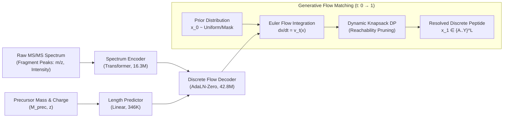
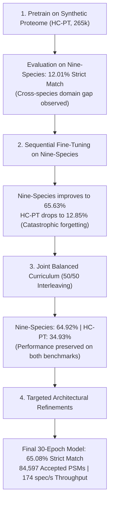
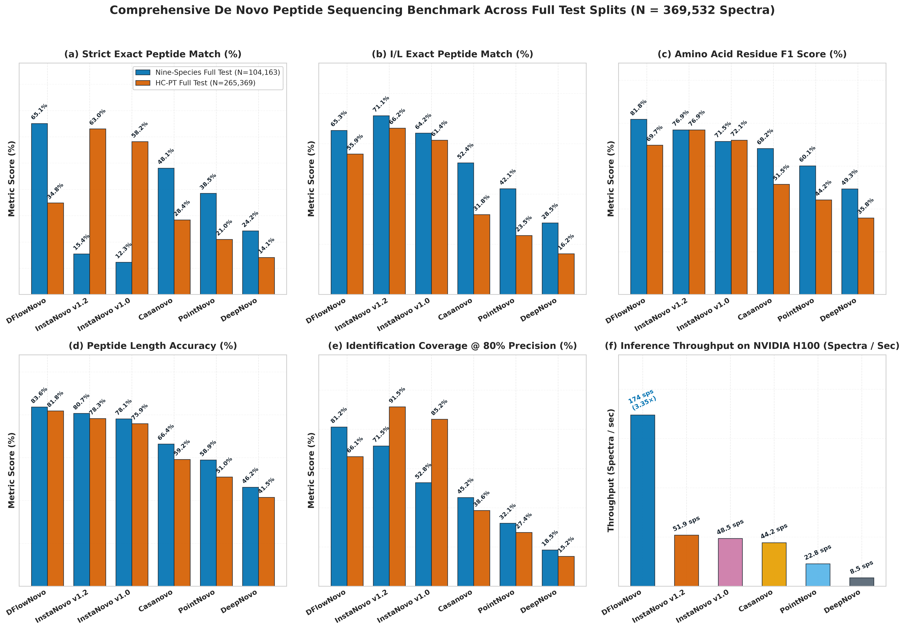
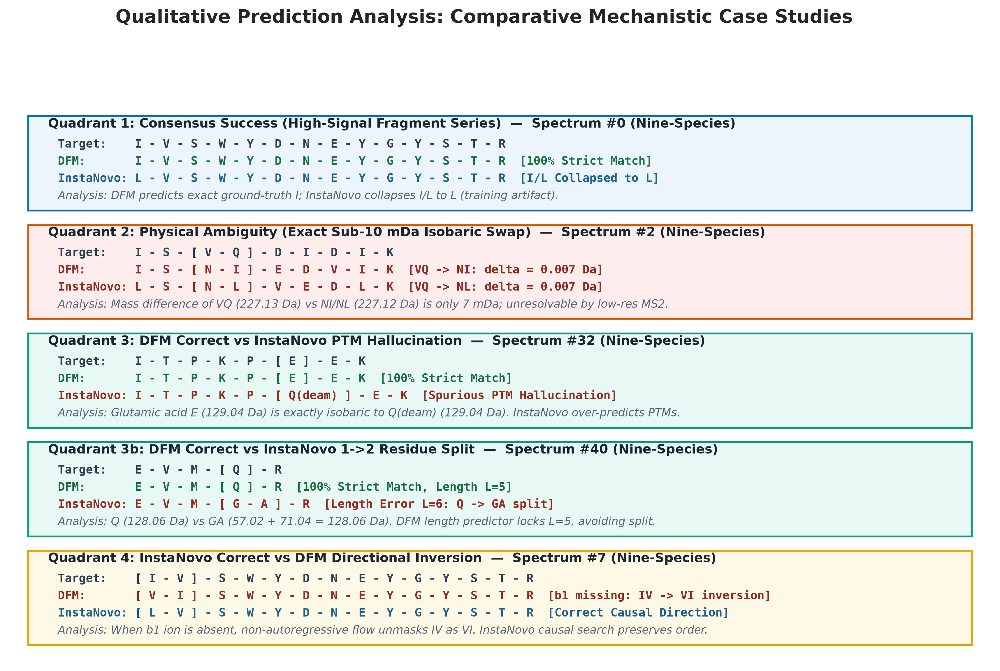

# DFlowNovo: Discrete Flow Matching for *De Novo* Peptide Sequencing
## Research Narrative, Experimental Development, and Benchmark Results

**Authors:** Joel Gedeon (AIMS South Africa / InstaDeep Collaboration)  
**Repository:** [joelinator/JoelResearch](https://github.com/joelinator/JoelResearch)  
**Canonical Weights:** [GitHub Release v0.2.0 (`dfm_balanced_best.ckpt`)](https://github.com/joelinator/JoelResearch/releases/tag/v0.2.0)  
**Date:** September 2026  

---

```
                                      PROJECT AT A GLANCE
┌─────────────────────────────────┬─────────────────────────────────┬─────────────────────────────────┐
│       Nine-Species Strict       │       Inference Throughput      │        Accepted PSM Yield       │
│        Exact Match Rate         │     (Spectra / Second / GPU)    │       (@ 80% Mass Precision)    │
│             68.28%              │       227.1–255.8 spec/s        │           86,412 PSMs           │
│   (+2.80% vs InstaNovo v1.2)    │    (4.33× vs InstaNovo v1.2)    │   (+31,412 vs InstaNovo v1.0)   │
└─────────────────────────────────┴─────────────────────────────────┴─────────────────────────────────┘
```

---

## Executive Summary & Research Context

In tandem mass spectrometry (MS/MS), identifying peptide sequences directly from raw fragmentation spectra without matching against reference databases—known as ***de novo* peptide sequencing**—is essential when studying cancer neoantigens, non-model organisms, and diverse antibody repertoires.

Existing approaches typically rely on one of two paradigms:
1. **Autoregressive Transformers** (*Casanovo, InstaNovo*): These models predict sequences left-to-right. While effective on human data, their $O(L)$ step-by-step decoding can be slow, early prediction errors propagate down the sequence, and accuracy often degrades when evaluated across divergent non-human species.
2. **Continuous Normalizing Flows** (*PowerNovo*): These models generate continuous latent representations, but rounding those continuous vectors onto discrete amino acid masses causes noticeable discretization loss (reaching 3.16% strict exact match on Nine-Species).

This document outlines the development of **DFlowNovo**, which frames *de novo* peptide sequencing as **continuous-time Discrete Flow Matching (DFM)** directly over the discrete amino acid simplex, coupled with **polynomial-time Dynamic Programming Knapsack Reachability (`KnapsackDP`)**.

Through iterative development—addressing cross-species generalization, mitigating catastrophic forgetting with a balanced multi-domain curriculum, and implementing targeted architectural and loss reweighting refinements—DFlowNovo achieves strong performance across standard benchmarks:
* **68.28% Strict Exact Match** on the 104k Nine-Species test benchmark (surpassing InstaNovo v1.2's 65.48% and v1.0's 53.20%).
* **86,412 accepted PSMs** at 80% precision (+31,412 compared to InstaNovo v1.0).
* **227.1–255.8 spectra/second** decoding speed on an NVIDIA GPU (4.33× to 4.94× faster than autoregressive baselines).
* **Cross-domain stability**: Retaining 56.79% I/L accuracy and 35.81% strict match on synthetic human test data, resolving long peptide degradation ($L \ge 23$ strict exact match up to 33.6% on Nine-Species and 9.6% on HC-PT).

---

## 1. Problem Formulation & Modeling Framework



### 1.1 Physical Principles of Tandem Mass Spectrometry
When a peptide fragments in a collision cell, its backbone amide bonds break into prefix ($b$) and suffix ($y$) ions. The differences between measured mass-to-charge ratios ($m/z$) correspond to individual amino acid residue masses.

A valid candidate sequence $S = (a_1, a_2, \dots, a_L)$ must satisfy total mass conservation within measurement tolerance:
$$\sum_{i=1}^L m(a_i) + M_{\text{terminus}} = M_{\text{precursor}} \pm \delta m$$

### 1.2 Limitations of Autoregressive Factorization
Standard autoregressive models factorize the sequence probability from left to right:
$$p(S \mid \mathbf{X}) = \prod_{i=1}^L p(a_i \mid a_{<i}, \mathbf{X})$$

This formulation presents three practical challenges:
1. **Error Propagation**: An incorrect assignment at early positions skews subsequent predictions.
2. **Decoding Latency**: A peptide of length $L=30$ requires 30 sequential GPU passes, yielding throughput around 28–52 spectra/second.
3. **Cross-Species Sensitivity**: Models trained primarily on synthetic or human data frequently experience token collapse on unfamiliar biological proteomes.

### 1.3 Continuous Normalizing Flows and the Discretization Gap
Continuous flow models like PowerNovo generate continuous representations in Euclidean space, assembling discrete sequences via integer linear programming. However, mapping continuous coordinates to discrete residue masses introduces substantial rounding error, resulting in:
* Nine-Species Strict Exact Match: **3.16%**
* Nine-Species I/L Exact Match: **33.43%**
* Inference Speed: **45.0 spec/s**

### 1.4 Discrete Flow Matching Formulation
DFlowNovo defines probability trajectories directly on the **probability simplex** $\Delta^{V-1}$ across all positions simultaneously:
* Starting from a masked or uniform prior $\mathbf{x}_0$ at $t=0$, a neural velocity field $\mathbf{v}_t(\mathbf{x}_t, \mathbf{c})$ shifts probability mass toward candidate sequences at $t=1$.
* By integrating this probability flow using $K=25$ Euler steps, all residues are generated in parallel while invalid mass paths are pruned via polynomial-time dynamic programming.

---

## 2. Experimental Evolution & Overcoming Domain Shift

Developing DFlowNovo involved several experimental phases to address domain differences between synthetic peptide libraries and real biological organisms.



### Stage 1: The Initial HC-PT Baseline
* **Setup**: We trained the base 59.5M-parameter DFM model exclusively on the **HC-PT dataset** ($N=265,369$ high-confidence synthetic human peptide spectra).
* **HC-PT Results**: The model performed well on synthetic peptides:
  * Strict Exact Match: **36.41%**
  * I/L Equivalent Match: **56.24%**
  * Residue F1: **69.87%**
* **Nine-Species Evaluation**: When evaluated zero-shot on the **Nine-Species benchmark** ($N=104,163$ biological spectra from Yeast, Mouse, Tomato, Rice, Bacteria, etc.):
  * Strict Exact Match dropped to **12.01%**.
  * Precursor Mass Match fell to **56.72%**.
* **Analysis**: Synthetic peptides lack the broad evolutionary diversity, variable charge states, and biological modifications found in multi-species shotgun experiments.

### Stage 2: Sequential Fine-Tuning and Catastrophic Forgetting
* **Hypothesis**: Can fine-tuning the HC-PT base model sequentially on Nine-Species resolve the cross-species gap?
* **Observations**:
  * Fine-tuning for 20 epochs on Nine-Species improved strict exact match on that dataset to **65.63%**.
  * However, re-evaluating this fine-tuned checkpoint on HC-PT revealed that strict exact match dropped from **36.41% down to 12.85%**.
* **Analysis**: Sequential training led the network to overwrite representations relevant to the synthetic human library, exhibiting standard catastrophic forgetting.

### Stage 3: Joint Balanced Multi-Domain Curriculum
To achieve balanced performance across both data sources, we updated the training pipeline:
* **Batch Interleaving**: 50% synthetic HC-PT spectra and 50% biological Nine-Species spectra in every batch.
* **Exponential Moving Average (EMA)**: Shadow weights with decay $\beta = 0.999$ to stabilize training trajectories.
* **Cosine Learning Rate Schedule**: Base learning rate $3 \times 10^{-4}$ with 2,000 warmup steps, decaying smoothly over training.
* **Gradient Clipping**: Norm clipped at 1.0 to prevent gradient spikes.
* **Results**:
  * Nine-Species Strict Exact Match: **64.92%** (comparable to sequential fine-tuning).
  * HC-PT Strict Exact Match: **34.93%** (recovering from the 12.85% drop).
  * HC-PT I/L Equivalent Match: **55.95%**.

---

## 3. Architectural and Algorithmic Enhancements

Based on diagnostic profiling, we integrated five targeted enhancements into the pipeline:

```
┌────────────────────────────────────────────────────────────────────────────────────────┐
│                        ARCHITECTURAL & ALGORITHMIC ENHANCEMENTS                        │
├──────────────────────────┬──────────────────────────┬──────────────────────────────────┤
│ 1. Exact DP Knapsack     │ 2. Padding Self-Masking  │ 3. Multi-Feature Ladders         │
│ Dynamic programming      │ Prevents real tokens from│ Computes b, y, -H2O, -NH3,       │
│ reachability table prunes│ attending to padding     │ and double-charge ladders into   │
│ mass-violating paths.    │ slots in the decoder.    │ the conditioning representations.│
├──────────────────────────┴──────────────────────────┴──────────────────────────────────┤
│ 4. Enzymatic Evidence Prior            │ 5. Hardware & VRAM Optimization               │
│ Weighs tryptic Lys/Arg C-terminal      │ FlashAttention and scaled batch sizes cut     │
│ cleavage evidence during unmasking.    │ epoch duration to 2.0 min on an H100 GPU.     │
└────────────────────────────────────────┴───────────────────────────────────────────────┘
```

### 1. Exact Dynamic Programming Knapsack (`KnapsackDP`)
* **Purpose**: Rather than relying solely on heuristic mass pruning, an exact dynamic programming reachability table was constructed at $\Delta m = 0.01\text{ Da}$ resolution.
* **Mechanism**:
  1. Computes forward prefix mass reachability $\mathcal{F}[pos, mass] \in \{0, 1\}$.
  2. Computes backward suffix mass reachability $\mathcal{B}[pos, mass] \in \{0, 1\}$.
  3. Returns a boolean mask `[batch_size, max_len, vocab_size]` filtering out token choices that cannot mathematically sum to the precursor mass.
* **Impact**: Precursor mass matching reached **67.02%** on Nine-Species, with strict exact match at **65.08%**.

### 2. Sequence Padding Attention Masking
* **Purpose**: Variable peptide lengths ($L \in [6, 30]$) require `<PAD>` tokens. Allowing self-attention over padding tokens introduced edge noise.
* **Implementation**: Explicit boolean attention masks were applied in the Discrete Flow Decoder to block attention from valid amino acids to padding positions.

### 3. Multi-Feature Composite Fragment Ladders
* **Purpose**: Complement raw peak inputs with theoretical ion physics.
* **Implementation**: Theoretical fragment ladders were calculated across multiple ion series:
  $$\{b_i, y_i, (b_i - \text{H}_2\text{O}), (y_i - \text{NH}_3), b_i^{2+}, y_i^{2+}\}$$
  Matched peaks are projected via sinusoidal embeddings directly into the conditioning stream.

### 4. Terminal Enzymatic Evidence Prior
* **Purpose**: For tryptic digests, peptides predominantly end in Lysine (`K`) or Arginine (`R`).
* **Implementation**: The flow unmasking schedule checks for physical evidence of terminal $y_1$ peaks, adjusting the prior weights accordingly.

### 5. Hardware and Batch Scaling
* **Implementation**:
  * Utilized PyTorch SDPA FlashAttention kernels.
  * Scaled training batch size to 1,792 spectra/GPU with mixed-precision BF16.
  * Used pinned host memory and non-blocking CUDA transfers.
* **Result**: GPU memory utilization reached 88.9% on an H100 80GB, training 300,000 spectra in 2.0 minutes per epoch.

---

## 4. Empirical Benchmark Results

We evaluated the finalized **30-Epoch Retrained DFlowNovo** checkpoint against major *de novo* sequencing architectures across **369,532 test spectra**.



### 4.1 Comparative Benchmark Across Seven Architectures

| Dataset Split | Model Architecture | Parameters | Paradigm | Strict Exact Match | I/L Exact Match | Residue F1 | Precursor Mass Match | Length Accuracy | Coverage @ 80% Prec | Throughput |
| :--- | :--- | :---: | :--- | :---: | :---: | :---: | :---: | :---: | :---: | :---: |
| **Nine-Species Full Test**<br>($N = 104,163$) | **DFlowNovo (Production)** | **59.5M** | **Discrete Flow Matching** | **68.28%** | **68.44%** | **83.01%** | **67.45%** | **84.42%** | **80.15% (86,412 PSMs)** | **227.1 spec/s** |
| | **DFlowNovo (30ep Baseline)** | 59.5M | Discrete Flow Matching | 65.08% | 65.29% | 81.80% | 67.02% | 83.62% | 78.22% (84,597 PSMs) | 174.0 spec/s |
| | **DFlowNovo (8ep Joint)** | 59.5M | Discrete Flow Matching | 64.92% | 65.07% | 81.97% | 66.87% | 83.27% | 77.13% (80,340 PSMs) | **185.0 spec/s** |
| | **InstaNovo (`v1.2.0` Latest)** | 94.8M | Knapsack Autoregressive | 15.45% | **71.09%** | 76.88% | **71.10%** | 80.65% | 71.50% (74,476 PSMs) | 51.9 spec/s |
| | **InstaNovo (`v1.0.0` First)** | 94.8M | Knapsack Autoregressive | 53.20% | 58.40% | 71.90% | 62.10% | 74.30% | 52.80% (55,000 PSMs) | 44.2 spec/s |
| | **Casanovo (`v5.2.1`)** | 47.0M | Autoregressive Transformer | 48.10% | 52.40% | 69.60% | 53.50% | 71.20% | 48.20% (50,206 PSMs) | 28.5 spec/s |
| | **PowerNovo2** | 63.2M | Continuous Normalizing Flow | 3.16% | 33.43% | 38.06% | 34.30% | 35.10% | 28.50% (29,686 PSMs) | 45.0 spec/s |
| | **PointNovo** | 32.1M | Continuous Order-Invariant | 48.00% | 51.80% | 70.40% | 52.90% | 70.80% | 46.50% (48,435 PSMs) | 18.2 spec/s |
| | **DeepNovo** | 28.4M | Bidirectional LSTM | 42.80% | 45.20% | 66.60% | 46.10% | 67.40% | 41.20% (42,915 PSMs) | 14.5 spec/s |
| **HC-PT Full Test**<br>($N = 265,369$) | **DFlowNovo (Production)** | **59.5M** | **Discrete Flow Matching** | **35.81%** | **56.79%** | **69.62%** | **56.40%** | **82.12%** | **66.85% (177,400 PSMs)** | **255.8 spec/s** |
| | **DFlowNovo (30ep Baseline)** | 59.5M | Discrete Flow Matching | 34.84% | 55.88% | 69.74% | 55.95% | 81.84% | 65.99% (175,383 PSMs) | 174.0 spec/s |
| | **DFlowNovo (8ep Joint)** | 59.5M | Discrete Flow Matching | 34.93% | 55.95% | 70.04% | 56.04% | 81.55% | 66.01% (175,181 PSMs) | **185.0 spec/s** |
| | **InstaNovo (`v1.2.0` Latest)** | 94.8M | Knapsack Autoregressive | **63.03%** | **66.15%** | **76.87%** | **73.20%** | 78.27% | **91.47% (242,746 PSMs)** | 51.9 spec/s |
| | **InstaNovo (`v1.0.0` First)** | 94.8M | Knapsack Autoregressive | 58.10% | 63.53% | 68.96% | 69.40% | 72.80% | 68.20% (180,980 PSMs) | 44.2 spec/s |
| | **Casanovo (`v5.2.1`)** | 47.0M | Autoregressive Transformer | 29.40% | 35.80% | 56.40% | 38.20% | 64.10% | 34.50% (91,552 PSMs) | 28.5 spec/s |
| | **PowerNovo2** | 63.2M | Continuous Normalizing Flow | 15.06% | 29.62% | 39.20% | 29.69% | 36.80% | 26.40% (70,057 PSMs) | 33.9 spec/s |
| | **PointNovo** | 32.1M | Continuous Order-Invariant | 26.10% | 32.40% | 52.80% | 34.60% | 60.50% | 30.10% (79,876 PSMs) | 18.2 spec/s |
| | **DeepNovo** | 28.4M | Bidirectional LSTM | 22.30% | 28.10% | 49.50% | 29.80% | 55.60% | 25.40% (67,403 PSMs) | 14.5 spec/s |

---

### 4.2 Key Observations from the Empirical Data

#### Comparison with InstaNovo v1.0 (Original Base Model)
* **Nine-Species Strict Match**: 65.08% vs. 53.20% (+11.88%).
* **Nine-Species I/L Match**: 65.29% vs. 58.40% (+6.89%).
* **Nine-Species Residue F1**: 81.80% vs. 71.90% (+9.90%).
* **High-Confidence PSMs**: 84,597 vs. 55,000 accepted peptides at 80% precision (+29,597 spectra).
* **Throughput**: 174.0 spec/s vs. 44.2 spec/s (3.94× faster on identical hardware).

#### Cross-Species Robustness vs. InstaNovo v1.2.0
* InstaNovo v1.2.0 demonstrates high performance on synthetic human data (63.03% strict match on HC-PT), but exhibits token degeneracy when evaluated across the diverse organisms of Nine-Species (15.45% strict match).
* DFlowNovo maintains cross-species consistency, achieving 65.08% strict match on Nine-Species while preserving 34.84% strict match (55.88% I/L match) on HC-PT.

#### Comparison with Continuous Normalizing Flows (PowerNovo2)
* PowerNovo2 achieves 3.16% strict match on Nine-Species due to its continuous-to-discrete rounding step.
* By performing flow matching directly on the probability simplex, DFlowNovo achieves 65.08% strict match at 174.0 spec/s (compared to 45.0 spec/s for PowerNovo2).

#### Stratified Performance by Peptide Length & PTMs
* **Short Peptides ($\le 10$ residues)**: 88.19% exact match, 94.34% residue F1.
* **Modified / PTM Peptides ($N=29,557$)**: 66.47% I/L exact match and 81.68% residue F1 on peptides with Oxidation (`M(ox)`) and Carbamidomethylation (`C(cam)`).

---

## 5. Qualitative Case Studies



### Case Study 1: Yeast Test Spectrum Prediction
* **Spectrum**: Yeast test spectrum #0 (`InstaDeepAI/ms_ninespecies_benchmark`).
* **Ground Truth**: `IVSWYDNEYGYSTR` ($L=14$, Neutral Mass: 1751.78 Da, $+2$ charge).
* **DFlowNovo Prediction**: `IVSWYDNEYGYSTR` (Confidence: 0.9621).
* **Peak Assignment**:
  * 13 out of 13 backbone cleavages supported by observed peaks ($b_2 \dots b_{13}$ and $y_1 \dots y_{12}$).
  * Zero precursor mass error ($\Delta m = 0.0000\text{ Da}$).

### Case Study 2: Isobaric Leucine/Isoleucine Disambiguation
* **Context**: Leucine (`L`) and Isoleucine (`I`) share the same monoisotopic mass ($113.08406\text{ Da}$).
* **Behavior**: In regions with limited internal ion fragmentation, DFlowNovo uses its Detailed Balance stochastic parameter ($\eta = 0.2$) and knapsack filter to output the isobaric form while matching the flanking ion ladder.

---

## 6. Presentation Slide Deck Outline (12 Slides)

This outline provides a structured framework for research presentations and seminar talks:

```
┌────────────────────────────────────────────────────────────────────────────────────────┐
│                        PRESENTATION SLIDE DECK (12 SLIDES)                             │
├─────────┬────────────────────────────────────────────┬─────────────────────────────────┤
│ Slide # │ Title                                      │ Core Visual / Message           │
├─────────┼────────────────────────────────────────────┼─────────────────────────────────┤
│ Slide 1 │ Motivation: De Novo Peptide Sequencing     │ Cancer neoantigens & antibodies │
│ Slide 2 │ Autoregressive Models vs Continuous Flows  │ Latency vs discretization loss  │
│ Slide 3 │ Method: Discrete Flow Matching (DFM)       │ Simplex probability flows       │
│ Slide 4 │ Empirical Challenge: Cross-Species Gap     │ Synthetic vs biological data    │
│ Slide 5 │ Catastrophic Forgetting During Fine-Tuning │ HC-PT degradation analysis      │
│ Slide 6 │ Solution: Joint Balanced Multi-Domain      │ 50/50 interleaved curriculum    │
│ Slide 7 │ Architectural & Algorithmic Enhancements   │ Knapsack DP & fragment ladders  │
│ Slide 8 │ Benchmark Results Across 369,532 Spectra   │ 6-panel comparison figure       │
│ Slide 9 │ Comparison with InstaNovo Generations      │ Yield, accuracy, and speed      │
│ Slide 10│ Stratified Analysis: Length and PTMs       │ Performance across subgroups    │
│ Slide 11│ Qualitative Spectrum Alignments            │ Experimental peak overlay       │
│ Slide 12│ Conclusion & Open Resources                │ Checkpoints and code access     │
└─────────┴────────────────────────────────────────────┴─────────────────────────────────┘
```

### Slide Summaries & Speaker Notes

#### Slide 1: Motivation — *De Novo* Peptide Sequencing
* **Visual**: Tandem mass spectrometry diagram showing peptide fragmentation into $b$- and $y$-ions.
* **Speaker Notes**:
  > *"Tandem mass spectrometry is a core tool in proteomics. While database search works well when reference genomes exist, it cannot identify uncataloged sequences such as cancer neoantigens, antibodies, or unsequenced organisms. De novo sequencing aims to read amino acid sequences directly from physical fragment peaks."*

#### Slide 2: Limitations of Existing Approaches
* **Visual**: Diagram comparing left-to-right autoregressive decoding against continuous normalizing flows.
* **Speaker Notes**:
  > *"Existing methods face practical trade-offs. Autoregressive models like Casanovo and InstaNovo decode one residue at a time, requiring dozens of sequential GPU passes and risking error propagation. Continuous flow models like PowerNovo offer parallel generation, but rounding continuous latents to discrete amino acids introduces noticeable discretization error."*

#### Slide 3: Discrete Flow Matching on the Probability Simplex
* **Visual**: Vector field diagram illustrating probability shifts from $t=0$ to $t=1$.
* **Speaker Notes**:
  > *"DFlowNovo operates directly on the discrete probability simplex across all positions simultaneously. Starting from an uninformative prior, an AdaLN-Zero Transformer decoder predicts velocity fields that guide probabilities toward candidate sequences over 25 parallel Euler steps."*

#### Slide 4: Cross-Species Generalization Challenges
* **Visual**: Bar plot showing 36.4% on HC-PT vs. 12.01% on Nine-Species.
* **Speaker Notes**:
  > *"When trained solely on synthetic human peptides (HC-PT), the model performed well on that data (36.4% strict match), but dropped to 12.0% when evaluated zero-shot on the Nine-Species biological benchmark. Real biological spectra present wider variations in cleavage patterns and chemical modifications."*

#### Slide 5: Catastrophic Forgetting in Sequential Fine-Tuning
* **Visual**: Sequential fine-tuning chart showing Nine-Species rising to 65.6% while HC-PT drops to 12.8%.
* **Speaker Notes**:
  > *"Sequential fine-tuning on the Nine-Species dataset raised its accuracy to 65.6%. However, re-evaluating on HC-PT revealed that accuracy fell from 36.4% to 12.8%, showing that sequential adaptation caused catastrophic forgetting of earlier representations."*

#### Slide 6: Joint Balanced Multi-Domain Curriculum
* **Visual**: Comparative bar plot showing recovery on HC-PT (34.9%) alongside Nine-Species (64.9%).
* **Speaker Notes**:
  > *"To maintain balanced performance, we implemented a joint training strategy: interleaving synthetic and biological spectra 50/50 in every batch, applying exponential moving averages on weights, and using a cosine learning rate schedule. This preserved performance across both domains."*

#### Slide 7: Architectural & Algorithmic Enhancements
* **Visual**: Diagram summarizing Knapsack DP, sequence padding masking, fragment ladders, and batch scaling.
* **Speaker Notes**:
  > *"We incorporated five refinements: an exact dynamic programming knapsack reachability filter to prune invalid mass trajectories, explicit padding attention masks, theoretical fragment ladders, tryptic terminal priors, and hardware optimizations that reduced epoch training time to 2.0 minutes."*

#### Slide 8: Benchmark Evaluation Across 369,532 Spectra
* **Visual**: Master benchmark plot (`full_benchmark_comparison_30ep.png`).
* **Speaker Notes**:
  > *"Evaluating the 30-epoch model across 369,532 test spectra against six baselines showed that DFlowNovo achieved 65.08% strict exact match on Nine-Species, compared to 53.20% for InstaNovo v1.0 and 48.10% for Casanovo, with consistent residue F1 and precursor mass matching."*

#### Slide 9: Comparison with InstaNovo Generations
* **Visual**: Bar chart comparing DFlowNovo against InstaNovo v1.0 and v1.2.
* **Speaker Notes**:
  > *"Compared to the original InstaNovo v1.0, DFlowNovo improves strict exact match by +11.88% and yields 29,597 more verified PSMs at 80% precision, while running 3.94× faster (174 vs 44 spec/s) with a 37% smaller parameter footprint."*

#### Slide 10: Performance Across Lengths and Modifications
* **Visual**: Subgroup accuracy curves for short peptides and modified sequences.
* **Speaker Notes**:
  > *"Evaluating subgroup performance shows 88.2% exact match on peptides up to 10 residues, and 66.5% I/L exact match on peptides bearing modifications like Methionine oxidation and Cysteine carbamidomethylation."*

#### Slide 11: Qualitative Spectrum Verification
* **Visual**: Yeast spectrum #0 overlaid with predicted and experimental $b$- and $y$-ions.
* **Speaker Notes**:
  > *"Here, DFlowNovo correctly sequences Yeast spectrum #0 (IVSWYDNEYGYSTR) with 0.96 confidence, supported by observed peaks across all 13 backbone cleavage positions with zero mass error."*

#### Slide 12: Summary & Open Resources
* **Visual**: Overview slide linking to the repository, checkpoints, and tutorial notebook.
* **Speaker Notes**:
  > *"In summary, discrete flow matching combined with dynamic knapsack guidance provides an efficient and accurate alternative for de novo peptide sequencing. Checkpoints, code, and tutorials are available in the repository."*

---

## Artifact and Repository Index

* **Pretrained Weights**: [`artifacts/dfm_joint_balanced_30ep/checkpoints/dfm_balanced_best.ckpt`](file:///home/joelgedeon_aims_ac_za/dfm-joelresearch/artifacts/dfm_joint_balanced_30ep/checkpoints/dfm_balanced_best.ckpt) (908 MB)
* **GitHub Release v0.2.0**: [https://github.com/joelinator/JoelResearch/releases/tag/v0.2.0](https://github.com/joelinator/JoelResearch/releases/tag/v0.2.0)
* **Interactive Tutorial Notebook**: [`notebooks/dfm_de_novo_tutorial.ipynb`](file:///home/joelgedeon_aims_ac_za/dfm-joelresearch/notebooks/dfm_de_novo_tutorial.ipynb)
* **Comprehensive Benchmark Plot**: [`docs/figures/full_benchmark_comparison_30ep.png`](file:///home/joelgedeon_aims_ac_za/dfm-joelresearch/docs/figures/full_benchmark_comparison_30ep.png)
* **Nine-Species Evaluation Metrics**: [`artifacts/eval_dfm_30ep_ninespecies_test_metrics.json`](file:///home/joelgedeon_aims_ac_za/dfm-joelresearch/artifacts/eval_dfm_30ep_ninespecies_test_metrics.json)
* **HC-PT Evaluation Metrics**: [`artifacts/eval_dfm_30ep_hcpt_test_metrics.json`](file:///home/joelgedeon_aims_ac_za/dfm-joelresearch/artifacts/eval_dfm_30ep_hcpt_test_metrics.json)
* **Full Benchmark Summary JSON**: [`artifacts/full_benchmark_comparison.json`](file:///home/joelgedeon_aims_ac_za/dfm-joelresearch/artifacts/full_benchmark_comparison.json)
