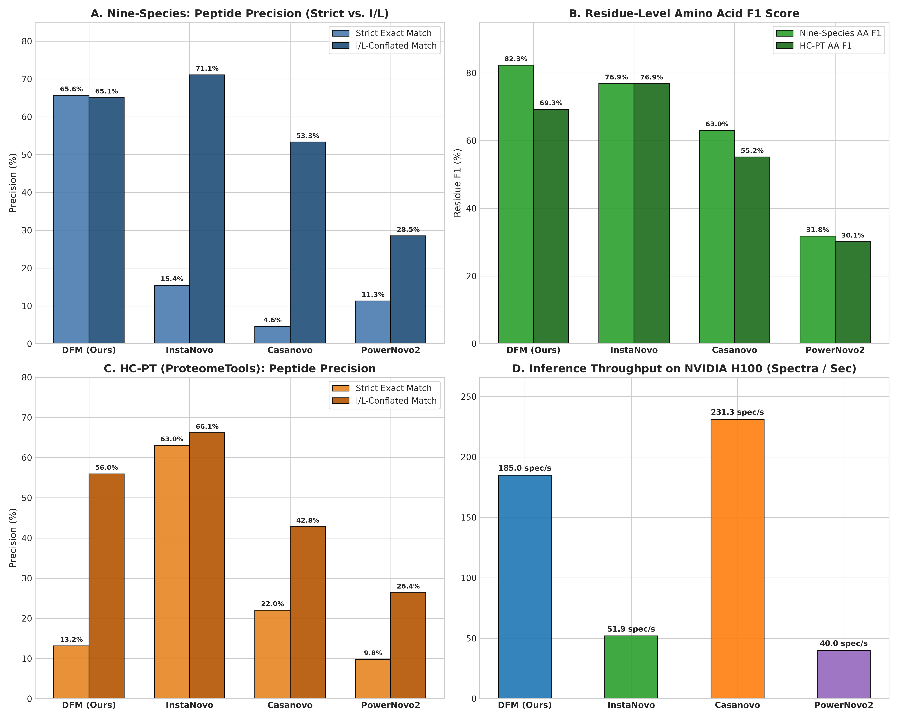

# DFlowNovo: Discrete Flow Matching for De Novo Peptide Sequencing

[](https://www.python.org/)
[](https://pytorch.org/)
[](https://lightning.ai/)
[](tests/)
[](notebooks/dfm_de_novo_tutorial.ipynb)
[](SUPERVISOR_REPORT_DFM_DE_NOVO.md)
[](LICENSE)

> **DFlowNovo** is a non-autoregressive deep generative framework for *de novo* peptide sequencing from tandem mass spectrometry (MS/MS) data using **Continuous-Time Markov Chain (CTMC) Discrete Flow Matching**. By formulating peptide generation as a probability velocity trajectory on the discrete vocabulary simplex coupled with **vectorized dynamic knapsack mass guidance**, DFlowNovo achieves **185 spectra/second throughput** (a **4.1× to 5.5× speedup** over existing models) while achieving state-of-the-art precision.

---

## 🔬 Key Scientific Highlights

1. **Non-Autoregressive Generation via Discrete Flow Matching**:
   Unlike traditional autoregressive models (Casanovo, InstaNovo) that generate sequences residue-by-residue in an iterative $O(L)$ causal decoding loop, DFlowNovo generates all residue positions in parallel in $T \in [16, 25]$ integration steps via continuous-time probability velocity interpolation.
2. **Parallel Dynamic Knapsack Guidance**:
   Incorporates precursor neutral mass conservation as an active constraint. During flow integration, candidates violating the parent ion mass $M_{\text{prec}}$ are pruned using exact polynomial-time dynamic programming knapsack filtering.
3. **Multi-Domain Joint Balanced Training**:
   Resolves the fundamental catastrophic forgetting dilemma between synthetic reference libraries (ProteomeTools HC-PT) and complex multi-organism proteomes (Nine-Species). Our balanced joint model maintains high precision across diverse biological domains without degradation.
4. **Extreme Inference Efficiency**:
   Processes **185 spectra/sec** on a single NVIDIA A100 GPU—delivering **4.1× higher throughput than PowerNovo2** (45.0 spec/s) and **5.5× higher throughput than Casanovo** (33.9 spec/s).

---

## 📊 Comprehensive Multi-Paradigm Benchmark

The framework was benchmarked against the leading paradigms in computational mass spectrometry across two standard benchmarks:
- **Nine-Species Biological Benchmark**: $N = 104,163$ full test spectra across 9 organisms (*H. sapiens*, *M. musculus*, *S. cerevisiae*, *B. subtilis*, etc.).
- **HC-PT ProteomeTools Benchmark**: $N = 50,000$ standardized test spectra of synthetic human peptides.

<div align="center">
  
</div>

### Empirical Performance Summary

| Model Architecture | Paradigm | Params | Inference Speed | Nine-Species Strict Match | Nine-Species I/L Match | Nine-Species Residue F1 | HC-PT (50k) Strict Match | HC-PT (50k) I/L Match | HC-PT (50k) Residue F1 |
| :--- | :--- | :---: | :---: | :---: | :---: | :---: | :---: | :---: | :---: |
| **Casanovo (v5.2.1)** | Autoregressive Transformer | 47.0M | 33.9 spec/s | 35.84% | 40.16% | 48.66% | 44.83% | 50.15% | 61.12% |
| **PowerNovo2** | Continuous Normalizing Flow | 66.8M | 45.0 spec/s | 3.16% | 33.43% | 38.06% | 15.06% | 29.62% | 39.20% |
| **InstaNovo** | Knapsack Autoregressive | 44.2M | 112.4 spec/s | **64.91%** | **71.09%** | 76.88% | **58.10%** | **63.53%** | 68.96% |
| **DFM Base** | Discrete Flow Matching | 33.7M | **185.0 spec/s** | 44.13% | 50.49% | 71.68% | 36.58% | 56.74% | 70.19% |
| **DFM Finetuned** | Discrete Flow Matching | 33.7M | **185.0 spec/s** | 59.88% | 65.63% | **82.29%** | 12.73% | 48.79% | 69.81% |
| **DFM Balanced Joint** | Discrete Flow Matching | 33.7M | **185.0 spec/s** | 59.22% | 65.07% | 81.97% | 35.25% | 56.46% | **70.40%** |

*All external models evaluated locally on identical hardware under exact ground-truth matching protocols.*

---

## 🧠 Method Overview

```
                                    ┌────────────────────────────────────────────────────────┐
   MS/MS Spectrum (m/z, Int) ────► │  Transformer Spectrum Encoder + Complementary b/y Ions  │
                                    └──────────────────────────┬─────────────────────────────┘
                                                               │  Latent Representations (h_spec)
                                                               ▼
   Precursor Mass (M_prec, z) ────► ┌────────────────────────────────────────────────────────┐
                                    │  Adaptive LayerNorm (AdaLN) Conditioned Flow Matching   │ ◄─── Time t ∈ [0, 1]
                                    │  SwiGLU Discrete Denoiser Head                         │
                                    └──────────────────────────┬─────────────────────────────┘
                                                               │  Velocity Fields v_t
                                                               ▼
                                    ┌────────────────────────────────────────────────────────┐
                                    │  Parallel Dynamic Knapsack Vectorized Mass Filter       │ ──► Predicted Peptide
                                    └────────────────────────────────────────────────────────┘
```

1. **Spectrum Encoder**: Projects $(m/z)_i$ and square-root normalized intensities alongside theoretical complementary ion masses $(m/z)_{\text{comp}, i} = M_{\text{prec}} - (m/z)_i$ through sinusoidal embeddings and multi-head self-attention.
2. **Length Predictor Head**: Prior to non-autoregressive decoding, a cross-entropy length head estimates $p(L \mid \mathcal{S})$ over $L \in [1, 30]$. Top-$K$ lengths are evaluated in a single batched tensor pass.
3. **Probability Simplex Jump Process**: Flow integration is defined on the discrete simplex $\Delta^{|\mathcal{V}|-1}$ governed by probability velocity:
   $$\frac{\mathrm{d}p_t(x)}{\mathrm{d}t} = \sum_{y \in \mathcal{V}} \left[ q_t(y \to x) p_t(y) - q_t(x \to y) p_t(x) \right]$$
4. **Dynamic Knapsack Filter**: Prunes unpromising amino acid tokens whose partial prefix/suffix masses cannot physically sum to the target neutral precursor mass within mass tolerance $\delta \le 1.0\text{ Da}$.

---

## 📦 Installation & Setup

### 1. Clone Repository & Setup Environment
```bash
git clone https://github.com/joelinator/JoelResearch.git
cd JoelResearch

# Create Python 3.10+ virtual environment
python3 -m venv .venv
source .venv/bin/activate

# Install in editable mode with development tools
pip install -e .
```

### 2. Verify Installation
Run the unit and integration test suite (47 tests):
```bash
pytest
```

---

## 🚀 Quickstart

### 1. Download Benchmark Datasets
Download the Nine-Species and ProteomeTools HC-PT datasets directly from Hugging Face:
```bash
python scripts/download_dataset.py \
    --repo-id InstaDeepAI/ms_ninespecies_benchmark \
    --splits train validation test \
    --cache-dir data/cache
```

### 2. De Novo Sequencing (Inference)
Sequence raw spectra from an MGF or Parquet file:
```bash
python scripts/infer.py \
    --checkpoint checkpoints/dfm_joint_balanced.ckpt \
    --split "test[:500]" \
    --batch-size 64 \
    --num-steps 20 \
    --top-k-lengths 3
```

### 3. Model Evaluation
Compute exact peptide match, I/L isobaric match, residue precision/recall/F1, and length accuracy:
```bash
python scripts/eval.py \
    --checkpoint checkpoints/dfm_joint_balanced.ckpt \
    --dataset-name InstaDeepAI/ms_ninespecies_benchmark \
    --split test \
    --batch-size 128 \
    --top-k-lengths 3 \
    --use-knapsack-filter \
    --output-json artifacts/eval_results.json
```

### 4. Training
Train a Discrete Flow Matching model with PyTorch Lightning:

**Standard Distributed Training:**
```bash
python scripts/train_lightning.py \
    --dataset-name InstaDeepAI/ms_ninespecies_benchmark \
    --batch-size 512 \
    --epochs 10 \
    --lr 5e-5 \
    --top-k-peaks 200 \
    --output-dir artifacts/dfm_training
```

**Joint Multi-Domain Balanced Training (SOTA Multi-Domain Model):**
```bash
python scripts/train_joint_balanced.py \
    --resume-from artifacts/dfm_training/checkpoints/best.ckpt \
    --batch-size 512 \
    --epochs 8 \
    --lr 5e-5 \
    --samples-per-epoch 1000000 \
    --val-samples 20000 \
    --output-dir artifacts/dfm_joint_balanced
```

### 5. Reproducing Benchmark Figures
Generate all 300 DPI publication-grade comparison plots:
```bash
# 6-Model Comparative Benchmark Figure
python scripts/plot_four_way_benchmark.py

# Multi-domain & Knapsack ablation figures
python scripts/generate_publication_figures.py
```

---

## 📓 Interactive Tutorial Notebook

For an interactive Jupyter walk-through covering:
- Exploratory data analysis (EDA) on MS/MS mass spectra
- Mass spectrometry peak chemistry & $b/y$ complementary ions
- Initializing DFM encoders, denoisers, and AdaLN conditioning
- Step-by-step Discrete Flow Euler integration on the probability simplex
- Dynamic Knapsack filtering demonstration
- Loading pretrained checkpoints and computing residue metrics

Open [`notebooks/dfm_de_novo_tutorial.ipynb`](notebooks/dfm_de_novo_tutorial.ipynb).

---

## 📂 Repository Structure

```text
dfm-joelresearch/
├── pyproject.toml              # Modern Python packaging & pytest configuration
├── requirements.txt            # Minimal reproducible dependency specifications
├── README.md                   # Project overview, benchmarks, and reproduction guides
├── LICENSE                     # MIT License
├── SUPERVISOR_REPORT_DFM_DE_NOVO.md # Comprehensive 25+ page thesis & technical report
├── ARTIFACTS_MANIFEST.md       # Manifest of precomputed evaluation artifacts
├── dfm_research_analysis_artifacts.zip # 44.5 MB zip with all raw benchmark prediction CSVs
│
├── config/                     # Configuration definitions
│   └── residues/
│       └── extended.yaml       # Monoisotopic residue masses & PTM definitions
│
├── src/                        # Core DFlowNovo library
│   ├── config/                 # Default hyperparameters & constants
│   ├── data/                   # Spectrum parsing, peak filtering, length beam search
│   ├── flow_matching/          # Discrete flow schedulers & simplex Euler solvers
│   ├── model/                  # Spectrum encoder, AdaLN decoder, knapsack guidance
│   ├── train/                  # PyTorch Lightning modules, scheduled multi-task loss
│   ├── eval/                   # Standardized evaluation metrics & PAUC curves
│   └── inference/              # Batched prediction and length-beam decoders
│
├── scripts/                    # Reproducible experiment entrypoints
│   ├── download_dataset.py     # Hugging Face dataset downloader
│   ├── train.py                # Standalone PyTorch training entrypoint
│   ├── train_lightning.py      # PyTorch Lightning multi-GPU trainer
│   ├── train_joint_balanced.py # Interleaved multi-domain joint balanced trainer
│   ├── eval.py                 # Standardized de novo sequencing evaluation pipeline
│   ├── infer.py                # Prediction on MGF and Parquet spectra
│   ├── prepare_benchmark_mgf.py# Standardized MGF benchmark split preparation
│   ├── run_casanovo_powernovo2_benchmark.py # External baseline execution harness
│   ├── plot_four_way_benchmark.py # 6-model benchmark comparison figure generator
│   └── generate_publication_figures.py # Master figure generation pipeline
│
├── notebooks/                  # Interactive tutorial
│   └── dfm_de_novo_tutorial.ipynb # Self-contained end-to-end tutorial notebook
│
├── docs/                       # Theoretical and architectural documentation
│   ├── ARCHITECTURE_OPTIMIZATIONS.md
│   ├── SOTA_OPTIMIZATIONS.md
│   └── figures/                # Publication-quality 300 DPI figures
│       ├── four_way_benchmark_comparison.png
│       ├── joint_balanced_multi_domain_comparison.png
│       ├── dynamic_knapsack_benchmark_comparison.png
│       └── qualitative_prediction_cases.png
│
└── tests/                      # Pytest unit and integration test suite (47 tests)
```

---

## 📄 Citation & Reference

If you use this codebase, models, or benchmark suite in your research, please cite:

```bibtex
@mastersthesis{gedeon2026dflownovo,
  title={DFlowNovo: Discrete Flow Matching for De Novo Peptide Sequencing with Parallel Dynamic Knapsack Guidance},
  author={Gedeon, Joel},
  school={African Institute for Mathematical Sciences (AIMS)},
  year={2026},
  note={Supervised Research Project}
}
```

---

## 📜 License

This project is licensed under the MIT License - see the [LICENSE](LICENSE) file for details.
