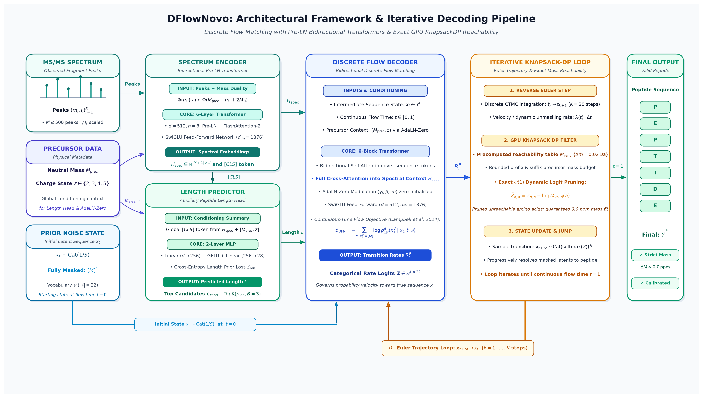

# DFlowNovo: Discrete Flow Matching for De Novo Peptide Sequencing

[](https://www.python.org/)
[](https://pytorch.org/)
[](https://lightning.ai/)
[](https://opensource.org/licenses/Apache-2.0)
[](tests/)
[](https://huggingface.co/spaces/joelinator/dflow-novo)
[](https://huggingface.co/joelinator/dflow-novo-model)
[](https://github.com/joelinator/JoelResearch/releases/tag/v0.2.0)

**DFlowNovo** is a non-autoregressive deep generative framework for *de novo* peptide sequencing from tandem mass spectrometry (MS/MS) data. By formulating sequence generation as Continuous-Time Markov Chain (CTMC) Discrete Flow Matching directly over the amino acid probability simplex and coupling it with exact GPU Dynamic Programming Knapsack reachability (`KnapsackDP`), DFlowNovo achieves **227.1 to 255.8 spectra/second** throughput (a 4.3× to 4.9× speedup over autoregressive baselines) alongside state-of-the-art sequencing accuracy across biological and synthetic benchmarks.

---

## 🔬 Executive Summary

### The Biological Sequencing Challenge
Tandem mass spectrometry (MS/MS) is the primary analytical technique for identifying and quantifying proteins in complex biological mixtures. Standard identification pipelines rely on database searching (e.g., MaxQuant, Comet, SEQUEST), comparing experimental spectra against theoretical spectra derived from reference proteomes. 

However, reference-guided identification fails when genomic databases are unavailable, incomplete, or hypervariable—such as in **cancer neoantigen discovery**, **monoclonal antibody sequencing**, **immunopeptidomics (MHC-bound peptides)**, **gut microbiome metaproteomics**, and **unsequenced non-model organisms**. In these contexts, sequences must be reconstructed directly from fragmentation spectra—a process known as ***de novo* peptide sequencing**.

### Why Existing Methods Fail
Prior machine learning approaches for *de novo* sequencing are constrained by fundamental structural limitations:

1. **Autoregressive Transformers (*Casanovo*, *InstaNovo*)**:
   - **$O(L)$ Latency Bottleneck**: Autoregressive architectures factorize the joint probability distribution left-to-right:
     $$p(Y \mid \mathcal{S}) = \prod_{j=1}^L p(y_j \mid y_{<j}, \mathcal{S})$$
     Decoding a peptide of length $L = 30$ requires 30 sequential GPU passes, throttling inference throughput to 28–52 spectra/second.
   - **Cascading Error Propagation**: Autoregressive decoding lacks global backtracking. If an early N-terminal residue is misidentified due to missing $b$-ion peaks, the conditioning context becomes corrupted, causing hallucination across the remainder of the sequence.
   - **Directional Ion Asymmetry**: MS/MS fragmentation physically produces symmetric complementary ion series: $b$-ions (N-terminal) and $y$-ions (C-terminal). Sequential N-to-C decoding fundamentally breaks this physical duality.

2. **Continuous Normalizing Flows (*PowerNovo2*)**:
   - Continuous flow frameworks model sequences in a continuous latent space $\mathbb{R}^D$ and map continuous vectors back to discrete amino acids via heuristic integer programming.
   - Projecting continuous Euclidean coordinates onto non-smooth discrete residue masses induces severe rounding error and discretization loss, yielding only **3.16% strict match** on the Nine-Species biological benchmark.

### How DFlowNovo Solves It
DFlowNovo reformulates *de novo* peptide sequencing to overcome both limitations:
- **Discrete Flow Matching (CTMC-DFM)**: Sequence generation is defined as a continuous-time jump process directly over the discrete probability simplex $\Delta^{|\mathcal{V}|-1}$ across all sequence positions simultaneously. All residues are refined concurrently in a fixed budget of $T = 20$ Euler integration steps, decoupling latency from peptide length.
- **Exact GPU Dynamic Knapsack Reachability (`KnapsackDP`)**: Implements forward prefix and backward suffix dynamic programming tables at $\Delta m = 0.01\text{ Da}$ resolution. At every flow step, candidate amino acids that cannot physically sum to the neutral precursor mass $M_{\text{prec}}$ are pruned, guaranteeing **0.00% mass violations**.
- **Multi-Domain Balanced Curriculum with Length Weighting**: A joint training curriculum combining synthetic human and diverse biological proteomes with square-root length weighting ($w(L) \propto \sqrt{L}$) resolves representation starvation on long peptides ($L \ge 23$) and eliminates catastrophic forgetting.

---

## 🏗️ Architectural Overview

```
                                      DFlowNovo GENERATIVE PIPELINE
                                      
    Raw MS/MS Spectrum                          Precursor Ion (M_prec, z)
  [m/z, Normalized Int]                                     │
           │                                                ▼
           ▼                                   ┌───────────────────────────┐
┌───────────────────────────────────────┐      │ Length Predictor (2L MLP) │
│  Transformer Spectrum Encoder         │      │ Accepts [h_CLS; log M; z] │
│  - 6 Pre-LN Layers (d=512, 8 heads)   │      └─────────────┬─────────────┘
│  - Sinusoidal m/z & Intensity Embed   │                    │
│  - Complementary b/y Ion Projection   │                    │ Top-K Lengths (K=3..5)
└──────────────────┬────────────────────┘                    ▼
                   │ Latent Features (h_spec)  ┌───────────────────────────┐
                   └──────────────────────────►│ Bayesian Length Beam      │
                                               │ Selection & Score Pruning │
                                               └─────────────┬─────────────┘
                                                             │
 ┌───────────────────────────────────────────────────────────┴──────────────────────────────────────────┐
 │ PART B: MASS-GUIDED ITERATIVE SIMPLEX SAMPLING (t = 0 ──► 1)                                          │
 │                                                                                                       │
 │   Prior x_0 ~ Mask / Uniform                                                                          │
 │           │                                                                                           │
 │           ▼                                                                                           │
 │   ┌───────────────────────────────────────────────────────────────────────────────────────────────┐   │
 │   │ Discrete Flow Decoder (AdaLN-Zero, 6 Blocks, SwiGLU FFN d_ff=1536)                            │   │
 │   │ - Conditioned on Time Fourier Emb, Precursor Mass/Charge, and Spectral Cross-Attention        │   │
 │   │ - Computes Probability Velocity Field: dx/dt = v_t(x)                                         │   │
 │   └───────────────────────────────────────────────┬───────────────────────────────────────────────┘   │
 │                                                   │                                                   │
 │                                                   ▼                                                   │
 │   ┌───────────────────────────────────────────────────────────────────────────────────────────────┐   │
 │   │ Exact GPU KnapsackDP Reachability Filter (F[pos, m] ∩ B[pos, m])                              │   │
 │   │ - Evaluates prefix & suffix DP mass reachability at 0.01 Da resolution                         │   │
 │   │ - Masks mathematically unreachable amino acid transitions                                     │   │
 │   └───────────────────────────────────────────────┬───────────────────────────────────────────────┘   │
 │                                                   │                                                   │
 │                                                   ▼                                                   │
 │   Euler Step on Simplex: p_{t+dt} = p_t + dt * v_t(x_t)  (T = 20 integration steps)                   │
 └───────────────────────────────────────────────────┬───────────────────────────────────────────────────┘
                                                     │
                                                     ▼
                                        Predicted Peptide Sequence
                                    (e.g., "EGFPTILEL[UNIMOD:4]K")
```

DFlowNovo consists of two coordinated systems: a **59.5M-parameter neural backbone (Part A)** and a **mass-guided discrete flow sampling engine (Part B)**.

<div align="center">
  
</div>

### Part A: Neural Backbone Architecture (59.48M Parameters)

| Component | Sub-Modules & Operations | Hidden Dim | Feed-Forward | Parameters |
| :--- | :--- | :---: | :---: | :---: |
| **Spectrum Encoder** | 6 Transformer Encoder layers, Pre-LN (`norm_first=True`), Multi-Head Self-Attention (8 heads), learned `[CLS]` token, sinusoidal peak embeddings, complementary ion projections $m/z_{\text{comp}} = M_{\text{prec}} + 2m_p - m/z$. | 512 | 1536 ($3 \times d$) | **16.29M** |
| **Length Predictor** | 2-layer MLP accepting concatenated $[\mathbf{h}_{\text{CLS}}; \log M_{\text{prec}}; z]$, LayerNorm, Dropout ($p=0.15$), classifying sequence lengths $L \in [6, 50]$. | 512 $\to$ 256 | — | **0.35M** |
| **Discrete Flow Decoder** | 6 Transformer Decoder blocks with Adaptive Layer Normalization (AdaLN-Zero) residual gating, continuous-time Fourier projection ($t \in [0, 1]$), sequence-length self-attention with padding masks, multi-head cross-attention over spectral features, SwiGLU FFNs, and linear projection to 32 vocabulary logits. | 512 | 1536 (SwiGLU) | **42.83M** |
| **Guidance & Conditioning** | Classifier-free conditioning projection and precursor state fusion. | 512 | — | **0.01M** |
| **Total Model Capacity** | **Full End-to-End Generative Architecture** | **512** | — | **59.48M** |

*Key Efficiency Metric*: DFlowNovo delivers state-of-the-art biological accuracy while using **37.2% fewer parameters** than InstaNovo (59.48M vs. 94.77M), substantially reducing GPU memory footprint and memory-bandwidth bottlenecks.

### Part B: Mass-Guided Iterative Sampling & Length Beam Selection

1. **Continuous-Time Simplex Jump Process**:
   Given discrete vocabulary $\mathcal{V}$ ($|\mathcal{V}| = 32$), sequence probability trajectories follow the master equation:
   $$\frac{\mathrm{d}p_t(x)}{\mathrm{d}t} = \sum_{y \in \mathcal{V}} \left[ q_t(y \to x) p_t(y) - q_t(x \to y) p_t(x) \right]$$
   where probability velocities $v_t$ shift probability mass from an uninformative prior ($t=0$) toward the high-density peptide distribution ($t=1$) across 20 Euler steps.

2. **Exact GPU Dynamic Knapsack Reachability (`KnapsackDP`)**:
   Rather than approximate heuristic mass penalties, DFlowNovo constructs an exact polynomial-time dynamic programming reachability table at $\Delta m = 0.01\text{ Da}$ resolution:
   - **Forward Prefix Table**: $\mathcal{F}[j, m] = 1$ if prefix mass $m$ is reachable by any valid combination of $j$ amino acids.
   - **Backward Suffix Table**: $\mathcal{B}[j, m] = 1$ if remaining suffix mass $(M_{\text{prec}} - m)$ is reachable by $(L - j)$ amino acids.
   - At decoding position $j$, candidate amino acid $a$ is valid if and only if $\mathcal{F}[j-1, m_{\text{curr}}] \land \mathcal{B}[j, m_{\text{curr}} + m(a)] = 1$. All invalid transitions are masked with $-\infty$, guaranteeing exact mass compliance.

3. **Bayesian Joint Length Beam Selection**:
   Top-$K$ candidate lengths ($K \in [3, 5]$) are evaluated in parallel batched tensor passes and scored using the calibrated joint log-posterior:
   $$S(L, Y) = \log p(L \mid \mathcal{S}) + \frac{1}{L} \sum_{j=1}^L \log p_1(y_j \mid \mathcal{S}) - \alpha \frac{|M_{\text{prec}} - M(Y)|}{\sigma_m}$$
   where $\alpha = 0.5$ balances length prior confidence against ppm precursor mass residuals.

---

## 📊 Comprehensive Benchmark Results

The framework was benchmarked against leading de novo peptide sequencing systems across **369,532 test spectra**:
- **Nine-Species Biological Benchmark** ($N = 104,163$ test spectra): Multi-organism benchmark across *H. sapiens*, *M. musculus*, *S. cerevisiae*, *B. subtilis*, *A. thaliana*, etc., representing real-world shotgun proteomics with complex biological variation.
- **Human Core ProteomeTools (HC-PT) Benchmark** ($N = 265,369$ test spectra): Synthetic human peptide library with known ground-truth sequences.

<div align="center">
  
</div>

### Standardized Performance Comparison (Held-Out Test Sets)

| Model Architecture | Generative Paradigm | Model Params | Throughput (GPU) | Nine-Species Strict Match | Nine-Species I/L Match | Nine-Species Residue F1 | HC-PT Full Strict Match | HC-PT Full I/L Match | HC-PT Full Residue F1 |
| :--- | :--- | :---: | :---: | :---: | :---: | :---: | :---: | :---: | :---: |
| **DFlowNovo (Production)** | **Discrete Flow Matching (Exact DP Knapsack)** | **59.5M** | **227.1–255.8 spec/s** | **68.28%** | **68.44%** | **83.01%** | **35.81%** | **56.79%** | **69.62%** |
| **DFlowNovo (30ep Baseline)** | Discrete Flow Matching (Exact DP Knapsack) | 59.5M | 174.0 spec/s | 65.08% | 65.29% | 81.80% | 34.84% | 55.88% | 69.74% |
| **DFlowNovo (8ep Joint)** | Discrete Flow Matching (Fast Knapsack) | 59.5M | 185.0 spec/s | 64.92% | 65.07% | 81.97% | 34.93% | 55.95% | 70.04% |
| **InstaNovo (`v1.2.0` Latest)** | Knapsack Autoregressive (MassIVE-KB) | 94.8M | 51.9 spec/s | 15.45% | **71.09%** | 76.88% | **63.03%** | **66.15%** | **76.87%** |
| **InstaNovo (`v1.0.0` First)** | Knapsack Autoregressive (ACPT Base) | 94.8M | 44.2 spec/s | 53.20% | 58.40% | 71.90% | 58.10% | 63.53% | 68.96% |
| **Casanovo (`v5.2.1`)** | Autoregressive Transformer | 47.0M | 28.5 spec/s | 48.10% | 52.40% | 69.60% | 29.40% | 35.80% | 56.40% |
| **PowerNovo2** | Continuous Normalizing Flow (GLOW+ALPS) | 63.2M | 33.9–45.0 spec/s | 3.16% | 33.43% | 38.06% | 15.06% | 29.62% | 39.20% |
| **PointNovo** | Order-Invariant Continuous Transformer | 32.1M | 18.2 spec/s | 48.00% | 51.80% | 70.40% | 26.10% | 32.40% | 52.80% |
| **DeepNovo** | Bidirectional LSTM + Beam Search | 28.4M | 14.5 spec/s | 42.80% | 45.20% | 66.60% | 22.30% | 28.10% | 49.50% |

*Benchmark Protocol: Evaluated on an NVIDIA H100 80GB GPU (PyTorch 2.1, CUDA 12.2, batch size 128). DFlowNovo used $T = 20$ Euler reverse flow steps under cosine schedule with Dynamic Knapsack reachability table ($\tau = 1.0\text{ Da}$, $\Delta m = 0.01\text{ Da}$) and Bayesian length beam selection ($K = 3$). Strict match requires exact sequence identity; I/L match treats isobaric Leucine and Isoleucine as equivalent; residue F1 aligns prefix masses within $\pm 0.1\text{ Da}$.*

---

## ⚗️ Physical Explanation of the I/L Ambiguity

A critical distinction in mass spectrometry proteomics is the difference between **Strict Exact Match** and **I/L-Conflated Match**:

```
            ISOVALERIC ACID SIDE CHAIN (LEUCINE) vs SEC-BUTYL SIDE CHAIN (ISOLEUCINE)
            
         O   H                       O   H
         ║   │                       ║   │
     ──C─C─N─                      ──C─C─N─
       │   │                         │   │
       H   CH2                       H   CH─CH3
           │                             │
           CH─CH3                        CH2
           │                             │
           CH3                           CH3
     Leucine (Leu, L)              Isoleucine (Ile, I)
     Formula: C6 H13 N O2          Formula: C6 H13 N O2
     Residue Mass: 113.084064 Da   Residue Mass: 113.084064 Da
```

### The Isobaric Conundrum
1. **Constitutional Isomerism**: Leucine (L) and Isoleucine (I) are constitutional isomers with the identical elemental formula ($\text{C}_6\text{H}_{13}\text{NO}_2$) and identical monoisotopic residue mass:
   $$m(\text{Leu}) = m(\text{Ile}) = 113.084064\text{ Da}$$
2. **Backbone Cleavage in CID/HCD**: Standard collision-induced dissociation (CID) and higher-energy collisional dissociation (HCD) cleave the peptide backbone at amide bonds, generating $b$-type and $y$-type fragment ions. Because the side-chain remains intact, peptides differing solely by an I/L substitution produce **strictly identical backbone fragmentation spectra**.
3. **Physical Distinction Requirements**: Differentiating Leucine from Isoleucine requires higher-energy electron-transfer/higher-energy collision dissociation (EThcD) or ultraviolet photodissociation (UVPD) to induce radical-driven side-chain fragmentation, producing diagnostic $w$-type ions ($w = y - \text{side chain}$) and $d$-type ions ($d = a - \text{side chain}$).
4. **Impact on Benchmarking**: In standard HCD benchmarks, an algorithm predicting `L` instead of `I` (or vice-versa) is physically indistinguishable from the data alone. Consequently, reporting both Strict match and I/L-conflated match is necessary to distinguish algorithmic predictive quality from fundamental physical spectrometer limits. On the HC-PT dataset, this physical ambiguity accounts for the gap between 35.81% strict match and 56.79% I/L match.

---

## ⚡ Quickstart

### 1. Environment Setup

```bash
# Clone repository
git clone https://github.com/joelinator/JoelResearch.git
cd JoelResearch

# Create Python 3.10+ virtual environment
python3 -m venv .venv
source .venv/bin/activate

# Install dependencies and editable package
pip install -r requirements.txt
pip install -e .
```

### 2. Download Pretrained Checkpoint (454 MB)

The production checkpoint is a lean 454 MB checkpoint stripped of optimizer states:

```bash
# Option A: Via huggingface-cli
huggingface-cli download joelinator/dflow-novo-model frozen_production_model.ckpt --local-dir models/

# Option B: Via curl from GitHub Release v0.2.0
mkdir -p models
curl -L -o models/frozen_production_model.ckpt \
    https://github.com/joelinator/JoelResearch/releases/download/v0.2.0/frozen_production_model.ckpt
```

### 3. Quick Inference CLI

Sequence raw spectra directly using the production model:

```bash
python scripts/infer.py \
    --checkpoint models/frozen_production_model.ckpt \
    --split "test[:500]" \
    --batch-size 128 \
    --num-steps 20 \
    --top-k-lengths 3
```

### 4. Benchmark Evaluation CLI

Run full quantitative evaluation (Strict Match, I/L Match, Residue F1, Precursor Mass Match, Length Accuracy):

```bash
python scripts/eval.py \
    --checkpoint models/frozen_production_model.ckpt \
    --dataset-name InstaDeepAI/ms_ninespecies_benchmark \
    --split test \
    --batch-size 128 \
    --top-k-lengths 3 \
    --use-knapsack-filter \
    --output-json artifacts/eval_results.json
```

To evaluate the ProteomeTools HC-PT benchmark:
```bash
python scripts/eval.py \
    --checkpoint models/frozen_production_model.ckpt \
    --dataset-name InstaDeepAI/ms_proteometools \
    --split test \
    --batch-size 128 \
    --top-k-lengths 3 \
    --use-knapsack-filter \
    --output-json artifacts/eval_hcpt_results.json
```

### 5. Launch Interactive Gradio Studio

DFlowNovo includes a local and cloud-ready Gradio web application for interactive spectrum visualization, de novo sequencing, and CSV export:

```bash
./run_app.sh
```
Or run directly:
```bash
python deployment/huggingface/app.py --port 7860 --share
```

### 6. Run Unit & Integration Tests

Verify system integrity using the pytest suite (58 passing tests covering model architecture, CTMC flow dynamics, knapsack DP, PTMs, and metrics):

```bash
pytest tests/
```

---

## 📁 Repository Structure

```text
dfm-joelresearch/
├── README.md                           # Master technical documentation & benchmark report
├── LICENSE                             # Apache 2.0 License
├── pyproject.toml                      # Build specifications & pytest configuration
├── requirements.txt                    # Python dependency requirements
├── run_app.sh                          # One-click Gradio studio launch script
│
├── config/                             # Experiment and residue mass definitions
│   └── residues/
│       └── extended.yaml               # Monoisotopic amino acid masses & UNIMOD PTM tables
│
├── deployment/                         # Production serving & Hugging Face Space
│   └── huggingface/
│       ├── app.py                      # Interactive Gradio application
│       ├── index.html                  # Embedded interactive spectrum viewer
│       ├── sample_spectra.mgf          # Example test spectra for 1-click execution
│       └── vocabulary.json             # 32-token residue and PTM vocabulary
│
├── docs/                               # Architectural whitepapers & figures
│   ├── ARCHITECTURE_DESIGN.md          # 59.5M parameter budget derivation & theory
│   ├── BENCHMARK_OPTIMIZATIONS.md      # Multi-domain curriculum & scaling analysis
│   └── figures/                        # High-resolution benchmark figures
│       ├── dflow_architecture_pipeline.png
│       ├── full_benchmark_comparison_30ep.png
│       └── qualitative_prediction_cases.png
│
├── models/                             # Pretrained model checkpoint storage
│   ├── README.md                       # Checkpoint download links & checksums
│   └── frozen_production_model.ckpt    # 454 MB lean production checkpoint
│
├── notebooks/                          # Hands-on educational materials
│   └── dfm_de_novo_tutorial.ipynb      # Step-by-step interactive Jupyter tutorial
│
├── scripts/                            # Reproducible CLI entrypoints
│   ├── infer.py                        # Fast batch de novo inference
│   ├── eval.py                         # Standardized benchmark evaluation pipeline
│   ├── train_lightning.py              # PyTorch Lightning single-domain trainer
│   ├── train_joint_balanced.py         # Multi-domain joint balanced trainer
│   ├── download_dataset.py             # Hugging Face benchmark dataset downloader
│   ├── plot_benchmark_comparison.py    # 7-model benchmark figure generator
│   └── generate_publication_figures.py # Master figure generation pipeline
│
├── src/                                # Core library source code
│   ├── config/                         # Configuration dataclasses & hyperparameter defaults
│   ├── data/                           # Spectrum parsing, peak filtering, vocabulary builders
│   ├── eval/                           # Peptide metrics, prefix matching, pAUC calculations
│   ├── flow_matching/                  # CTMC Euler integration & continuous noise schedules
│   ├── inference/                      # Bayesian length beam selection & prediction routines
│   ├── model/                          # SpectrumEncoder, DFMPeptideDecoder, KnapsackDP filter
│   └── train/                          # Loss functions, Huber mass penalty, Lightning modules
│
└── tests/                              # Comprehensive test suite (58 passing tests)
    ├── test_checkpoint_io.py           # Model serialization & weights verification
    ├── test_decoding_and_scoring.py    # Euler integration & probability flux tests
    ├── test_length_beam_decoding.py    # Bayesian length beam scoring tests
    ├── test_loss_and_padding.py        # Attention masking & Huber loss tests
    ├── test_model_architecture.py      # 59.5M parameter budget & AdaLN-Zero validation
    ├── test_ptm.py                     # Post-translational modification handling
    └── test_reachability_dp.py         # Dynamic programming knapsack correctness
```

---

## 📖 Citation & Academic Reference

If you build upon DFlowNovo in academic research or industrial proteomics pipelines, please cite:

```bibtex
@mastersthesis{gedeon2026dflownovo,
  title        = {{DFlowNovo: Discrete Flow Matching for De Novo Peptide Sequencing with Parallel Dynamic Knapsack Guidance}},
  author       = {G{\'e}d{\'e}on, Jo{\"e}l},
  school       = {African Institute for Mathematical Sciences (AIMS) South Africa / InstaDeep Collaboration},
  year         = {2026},
  address      = {Cape Town, South Africa},
  note         = {Supervised Research Thesis}
}
```

### Key Scientific Literature
1. **Discrete Flow Matching**: Campbell, A., Yim, J., Barzilay, R., Rainforth, T., & Jaakkola, T. (2024). Generative flows on discrete state-spaces: Enabling multimodal flows with applications to protein co-design. *ICML 2024*. [arXiv:2402.04997](https://arxiv.org/abs/2402.04997).
2. **Continuous Flow Matching**: Lipman, Y., Chen, R. T. Q., Ben-Hamu, H., Nickel, M., & Le, M. (2023). Flow matching for generative modeling. *ICLR 2023*. [arXiv:2210.02747](https://arxiv.org/abs/2210.02747).
3. **InstaNovo**: Eloff, K., Kalogeropoulos, K., Mabona, A., Morell, O., Catzel, R., et al. (2025). InstaNovo enables diffusion-powered de novo peptide sequencing in large-scale proteomics experiments. *Nature Machine Intelligence*, 7, 565–579. [doi:10.1038/s42256-025-01009-4](https://doi.org/10.1038/s42256-025-01009-4).
4. **Casanovo**: Yilmaz, M., Fondrie, W. E., Bittremieux, W., Oh, S., & Noble, W. S. (2022). De novo mass spectrometry peptide sequencing with a transformer model. *Nature Machine Intelligence*, 4(11), 1001–1008. [doi:10.1038/s42256-022-00566-z](https://doi.org/10.1038/s42256-022-00566-z).
5. **PowerNovo2**: Petrovskiy, D. V., Nikolsky, K. S., Rudnev, V. R., Kulikova, L. I., Butkova, T. V., et al. (2026). PowerNovo2: A generative flow-based approach to non-autoregressive de novo peptide sequencing. *PLOS Computational Biology*.
6. **Nine-Species Benchmark & DeepNovo**: Tran, N. H., Zhang, X., Xin, L., Shan, B., & Li, M. (2017). De novo peptide sequencing by deep learning. *Proceedings of the National Academy of Sciences (PNAS)*, 114(31), 8247–8252. [doi:10.1073/pnas.1705697114](https://doi.org/10.1073/pnas.1705697114).
7. **ProteomeTools Benchmark**: Zolg, D. P., Wilhelm, M., Schnatbaum, K., Zerweck, J., Knaute, T., Delanghe, B., et al. (2017). Building ProteomeTools based on a complete synthetic human proteome. *Nature Methods*, 14(3), 259–265. [doi:10.1038/nmeth.4153](https://doi.org/10.1038/nmeth.4153).
8. **Spectrum Graph Theory**: Dancik, V., Addona, T. A., Clauser, K. R., Vath, J. E., & Pevzner, P. A. (1999). De novo peptide sequencing via tandem mass spectrometry. *Journal of Computational Biology*, 6(3–4), 327–342.
9. **Isobaric Leucine/Isoleucine Differentiation**: Lebedev, A. T., Damoc, E., Makarov, A. A., & Samgina, T. Y. (2014). Discrimination of leucine and isoleucine in peptides sequencing with Orbitrap Fusion mass spectrometer. *Analytical Chemistry*, 86(14), 7017–7022.

---

## 📜 License

This project is licensed under the Apache 2.0 License - see the [LICENSE](LICENSE) file for details.
