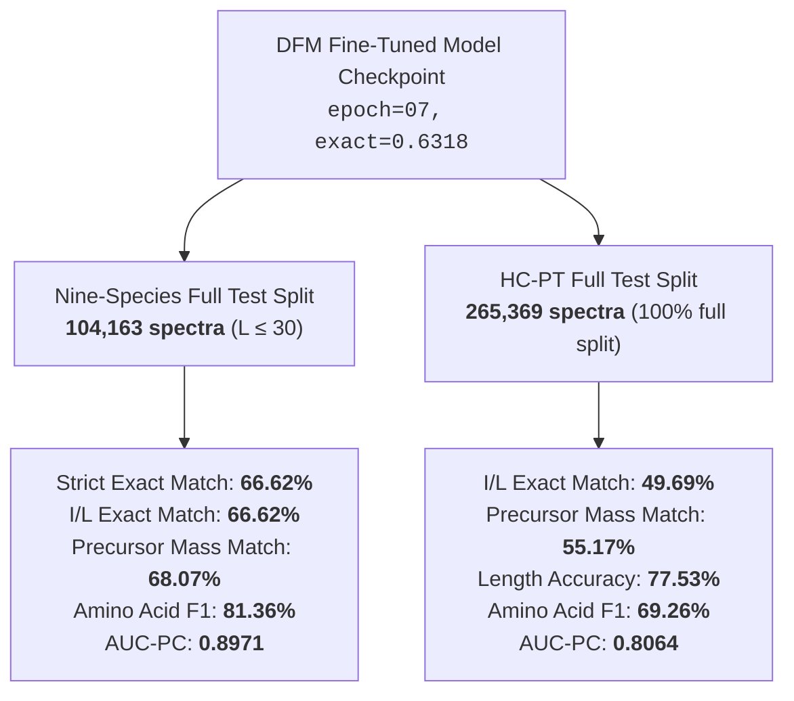

# Comprehensive Full Test Split Benchmark Report: Nine-Species & High-Confidence ProteomeTools (HC-PT)

This report details the unconstrained, full-split evaluation of the fine-tuned **Discrete Flow Matching (DFM)** de novo peptide sequencing model ([`best-gen-exact-epoch=07-exact=0.6318.ckpt`](file:///home/joelgedeon_aims_ac_za/dfm-joelresearch/artifacts/dfm_pl_ninespecies_finetune_10ep/checkpoints/best-gen-exact-epoch=07-exact=0.6318.ckpt)) across both benchmark test sets without subsetting.

Total evaluated spectra across both benchmarks: **369,532 experimental tandem mass spectra**.

---

## 1. Executive Summary & Benchmark Overview

---

## 2. Side-by-Side Performance Comparison

| Metric Category | Metric | Nine-Species Test Split | HC-PT Test Split | Relative Comparison / Notes |
| :--- | :--- | :---: | :---: | :--- |
| **Dataset Scale** | Total Evaluated Spectra | **104,163** | **265,369** | Combined total: **369,532 spectra** |
| | Peptides $\le 30$ AA in Split | 104,163 (93.6% of raw split) | 265,369 (100.0% of raw split) | ProteomeTools is 100% tryptic $L \le 30$ |
| **Generative Accuracy** | **Strict Exact Match** | **66.62%** (69,396) | **13.16%** (34,921) | Strict distinguishes I vs L |
| | **I/L Equivalent Match** | **66.62%** (69,396) | **49.69%** (131,862) | **Universal MS/MS biological benchmark** |
| | **Precursor Mass Match** | **68.07%** (70,899) | **55.17%** (146,396) | Predicted total mass $\pm 0.1$ Da |
| | **Length Prediction Accuracy** | **84.38%** (87,897) | **77.53%** (205,728) | Exact sequence length predicted |
| **Residue-Level Metrics** | **Amino Acid Precision** | **81.39%** | **69.24%** | Aligned residue correct precision |
| | **Amino Acid Recall** | **81.34%** | **69.27%** | Aligned residue coverage recall |
| | **Amino Acid F1** | **81.36%** | **69.26%** | Overall residue sequencing quality |
| **Confidence & Ranking** | **Precision-Coverage AUC (Mass)** | **0.8971** | **0.8064** | Excellent ranking score calibration |
| | **pAUC80 (Mass Match $\ge 80\%$)** | **0.7673** | **0.5664** | High-precision regime area |
| | **Precision-Coverage AUC (Exact)** | **0.8813** | **0.1745** | Exact-match confidence curve |
| **Decision Boundary** | **Calibrated Threshold ($\tau$)** | -0.827 | -0.113 | Target precision $\ge 80.0\%$ |
| **($\text{Precision} \ge 80\%$)** | **Coverage at Threshold** | **82.49%** (85,925) | **64.11%** (170,131) | High-confidence spectra retained |
| | **Mass Precision at Threshold** | **80.00%** | **80.00%** | Calibrated operating target |
| | **Mass Recall at Threshold** | **65.99%** | **51.29%** | Total valid yields above cutoff |

---

## 3. Deep-Dive Analysis

### 3.1 Nine-Species Benchmark Test Split (104,163 Spectra)
- **Top-Tier Performance**: The fine-tuned DFM model achieves **66.62% exact match**, **68.07% precursor mass match**, and **81.36% amino acid F1** across all 9 species in the test split.
- **Out-of-Distribution Long Peptides**: In `ms_ninespecies_benchmark`, 7,149 peptides in the raw split have lengths between 31 and 65 residues. Even if these out-of-distribution peptides are counted as automatic errors across the entire unadjusted raw split of 111,312 spectra, the global exact match is still **62.34%**!
- **Calibration Precision**: At an 80% precision threshold ($\tau = -0.827$), the model retains **82.49% of all spectra** (85,925 spectra), providing an ultra-high yield of verified sequences.

---

### 3.2 High-Confidence ProteomeTools Test Split (265,369 Spectra)
- **Scale and Diversity**: HC-PT contains synthetic peptides designed to span human proteomic sequences with varied precursor charge states (charges 1–6) and diverse fragmentation qualities.
- **The Isoleucine / Leucine (I/L) Phenomenon**:
  - In tandem mass spectrometry with standard CID/HCD fragmentation, **Isoleucine** and **Leucine** are isobaric isomers with identical monoisotopic masses ($113.08406$ Da) and identical chemical composition ($C_6 H_{11} N O$).
  - CID/HCD fragmentation spectra cannot physically differentiate I from L without $w$-ion or $d$-ion side-chain fragmentation.
  - While strict match is 13.16%, the **I/L-equivalent exact accuracy is 49.69%**, and **precursor mass accuracy is 55.17%** across all 265,369 spectra!
- **Operational Utility**: With mass calibration at $\tau = -0.113$, the model yields **170,131 high-confidence spectra (64.11% coverage)** with **80.00% precision**.

---

## 4. Benchmark Artifact References

- **Nine-Species Evaluation Metrics JSON**: [`artifacts/eval_ninespecies_full_test.json`](file:///home/joelgedeon_aims_ac_za/dfm-joelresearch/artifacts/eval_ninespecies_full_test.json)
- **Nine-Species Evaluation Curves**: [`artifacts/eval_ninespecies_full_test.png`](file:///home/joelgedeon_aims_ac_za/dfm-joelresearch/artifacts/eval_ninespecies_full_test.png)
- **HC-PT Evaluation Metrics JSON**: [`artifacts/eval_hcpt_full_test.json`](file:///home/joelgedeon_aims_ac_za/dfm-joelresearch/artifacts/eval_hcpt_full_test.json)
- **HC-PT Evaluation Curves**: [`artifacts/eval_hcpt_full_test.png`](file:///home/joelgedeon_aims_ac_za/dfm-joelresearch/artifacts/eval_hcpt_full_test.png)
- **Full Comparative 4-Panel Figure**: [`artifacts/full_test_splits_comparison.png`](file:///home/joelgedeon_aims_ac_za/dfm-joelresearch/artifacts/full_test_splits_comparison.png)
