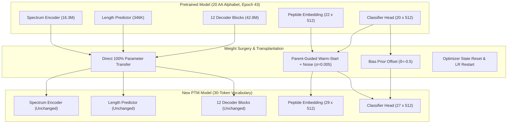

# Post-Translational Modifications (PTM) Fine-Tuning Strategy

## 1. Executive Summary & Problem Formulation

In mass spectrometry (MS/MS) based *de novo* peptide sequencing, real-world biological samples frequently contain post-translational modifications (PTMs). Conventional models trained strictly on the standard 20 amino acid alphabet either:
1. Misidentify modified peptides as unmodified sequences, causing significant precursor and fragment mass discrepancy.
2. Miss modified spectra entirely, resulting in truncated peptide identifications and degraded sensitivity.

Retraining an entire 59.5M parameter Discrete Flow Matching (DFM) model from scratch to incorporate PTMs is computationally expensive and biochemically inefficient. Over 98% of the model’s learned knowledge—including MS2 spectral peak encoding, precursor charge handling, peptide length estimation, and structural cross-attention dynamics—is modification-agnostic.

This document describes the **Weight Surgery and Warm-Start Fine-Tuning Strategy** developed for DFlowNovo. This strategy enables the network to expand its vocabulary from 20 to 27 amino acid tokens (plus special tokens) while preserving 100% of the pretrained backbone weights, allowing immediate training convergence without catastrophic forgetting.



---

## 2. Biochemical Foundations & Target Modifications

The target vocabulary focuses on the most frequent variable and fixed modifications observed in bottom-up proteomics datasets (e.g., `InstaDeepAI/ms_proteometools`):

| Token | Modification Name | Target Residue | Formula Shift | Delta Mass ($\Delta m$) | Monoisotopic Residue Mass |
| :---: | :--- | :---: | :---: | :---: | :---: |
| `C(cam)` | Carbamidomethylation | Cysteine (`C`) | $+\text{C}_2\text{H}_3\text{NO}$ | $+57.021464\text{ Da}$ | $160.030648\text{ Da}$ |
| `M(ox)` | Oxidation | Methionine (`M`) | $+\text{O}$ | $+15.994915\text{ Da}$ | $147.035399\text{ Da}$ |
| `N(deam)` | Deamidation | Asparagine (`N`) | $-\text{NH}_3 + \text{H}_2\text{O}$ | $+0.984016\text{ Da}$ | $115.026943\text{ Da}$ |
| `Q(deam)` | Deamidation | Glutamine (`Q`) | $-\text{NH}_3 + \text{H}_2\text{O}$ | $+0.984016\text{ Da}$ | $129.042593\text{ Da}$ |
| `S(ph)` | Phosphorylation | Serine (`S`) | $+\text{HPO}_3$ | $+79.966331\text{ Da}$ | $166.998359\text{ Da}$ |
| `T(ph)` | Phosphorylation | Threonine (`T`) | $+\text{HPO}_3$ | $+79.966331\text{ Da}$ | $181.014009\text{ Da}$ |
| `Y(ph)` | Phosphorylation | Tyrosine (`Y`) | $+\text{HPO}_3$ | $+79.966331\text{ Da}$ | $243.029659\text{ Da}$ |

### Alias and Mass Delta Normalization
The dataset column `modified_sequence` frequently represents PTMs using mass-shift notation (e.g., `M(+15.99)`, `C(+57.02)`, `S(+79.97)`). The parser ([`parse_peptide`](file:///home/joelgedeon_aims_ac_za/dfm-joelresearch/src/data/data.py#L35-L60)) normalizes all delta annotations to canonical tokens via [`PTM_ALIAS_MAP`](file:///home/joelgedeon_aims_ac_za/dfm-joelresearch/src/data/constants.py#L80-L105).

---

## 3. Vocabulary Architecture & Logits Alignment

To preserve downstream matrix multiplications, token indices are arranged in contiguous blocks:

```
[0 ................. 19] [20 ................ 26] [27]    [28]
  Standard Amino Acids      PTM Residues Tokens   <pad>  <mask_token>
```

1. **Output Vocabulary Size**:
   $$\text{output\_vocab\_size} = 20\ (\text{standard}) + 7\ (\text{PTMs}) = 27$$
   The classification head [`decoder.head`](file:///home/joelgedeon_aims_ac_za/dfm-joelresearch/src/model/model.py#L190-L215) projects to $27$ logits. Special tokens `<pad>` and `<mask_token>` are never predicted by the generative decoder during inference.
2. **Embedding Vocabulary Size**:
   $$\text{total\_vocab\_size} = \max(\text{vocab.values()}) + 1 = 29$$
   The embedding matrix [`decoder.peptide_embedding`](file:///home/joelgedeon_aims_ac_za/dfm-joelresearch/src/model/model.py#L180-L195) is shaped $(29, 512)$, accommodating all 27 residue classes, index 27 (`<pad>`), and index 28 (`<mask_token>`).
3. **Mass Alignment Buffer**:
   The tensor [`aa_masses`](file:///home/joelgedeon_aims_ac_za/dfm-joelresearch/src/data/data.py#L146-L150) is shaped $(27,)$, indexing the exact monoisotopic residue masses aligned 1-to-1 with the decoder's output logits. This buffer is critical for:
   - Dynamic length-beam mass discrepancy penalties during inference.
   - Dynamic theoretical $b$-ion / $y$-ion fragment mass calculations.
   - Prefix mass verification in evaluation metrics.

---

## 4. Neural Weight Surgery Mechanics

The weight surgery module ([`src/train/surgery.py`](file:///home/joelgedeon_aims_ac_za/dfm-joelresearch/src/train/surgery.py)) executes the checkpoint transplantation.

### Mathematical Formulation

Let $\mathcal{A}_{\text{std}}$ be the standard amino acids ($0 \le i < 20$) and $\mathcal{A}_{\text{ptm}}$ be the target PTM tokens ($20 \le j < 27$). Let $\pi(j) \in \mathcal{A}_{\text{std}}$ denote the parent residue of PTM token $j$ (e.g., $\pi(\text{M(ox)}) = \text{M}$).

1. **Peptide Embedding Matrix** $\mathbf{E} \in \mathbb{R}^{29 \times d}$:
   $$\mathbf{E}^{\text{new}}[i] = \mathbf{E}^{\text{old}}[i] \quad \forall i \in \mathcal{A}_{\text{std}}$$
   $$\mathbf{E}^{\text{new}}[j] = \mathbf{E}^{\text{old}}[\pi(j)] + \boldsymbol{\epsilon}_j, \quad \boldsymbol{\epsilon}_j \sim \mathcal{N}(\mathbf{0}, \sigma^2 \mathbf{I}) \quad \forall j \in \mathcal{A}_{\text{ptm}}$$
   $$\mathbf{E}^{\text{new}}[\text{pad}_{\text{new}}] = \mathbf{E}^{\text{old}}[\text{pad}_{\text{old}}]$$
   $$\mathbf{E}^{\text{new}}[\text{mask}_{\text{new}}] = \mathbf{E}^{\text{old}}[\text{mask}_{\text{old}}]$$
   *Where $\sigma = 0.005$ breaks exact symmetry while retaining the parent's biochemical semantic vector.*

2. **Classification Projection Matrix** $\mathbf{W} \in \mathbb{R}^{27 \times d}$:
   $$\mathbf{W}^{\text{new}}[i, :] = \mathbf{W}^{\text{old}}[i, :] \quad \forall i \in \mathcal{A}_{\text{std}}$$
   $$\mathbf{W}^{\text{new}}[j, :] = \mathbf{W}^{\text{old}}[\pi(j), :] + \boldsymbol{\epsilon}_j \quad \forall j \in \mathcal{A}_{\text{ptm}}$$

3. **Classification Bias Vector** $\mathbf{b} \in \mathbb{R}^{27}$:
   $$\mathbf{b}^{\text{new}}[i] = \mathbf{b}^{\text{old}}[i] \quad \forall i \in \mathcal{A}_{\text{std}}$$
   $$\mathbf{b}^{\text{new}}[j] = \mathbf{b}^{\text{old}}[\pi(j)] + \delta_{\text{bias}} \quad \forall j \in \mathcal{A}_{\text{ptm}}$$
   *Where $\delta_{\text{bias}} = -0.5$ serves as a negative logit prior. This prevents uncalibrated PTM predictions from destabilizing early batches before the model encounters modified spectrum examples.*

4. **100% Preserved Subnetworks**:
   All parameters for the following modules are transferred bit-for-bit with zero modification:
   - `spectrum_encoder.*` (16.3M parameters)
   - `length_predictor.*` (346K parameters)
   - `guidance.*` (512 parameters)
   - `decoder.blocks.*` (12 transformer blocks, 42.8M parameters)
   - Exponential Moving Average (`EMA`) shadow parameters for all matching layers.

5. **Optimizer & Scheduler State**:
   Optimizer momentum ($\mathbf{m}$) and variance ($\mathbf{v}$) states from previous Adam steps are discarded (`reset_lr_on_resume=True`, `weights_only=True`). Retaining old second-moment estimates for modified layers causes gradient overshoot upon re-initialization.

---

## 5. Tokenization & Sequence Ingestion Pipeline

### Regex Tokenizer
The sequence parser [`parse_peptide`](file:///home/joelgedeon_aims_ac_za/dfm-joelresearch/src/data/data.py#L35-L60) uses the regex pattern:
```python
TOKEN_PATTERN = re.compile(r"([A-Z](?:\([^\)]+\)|\[[^\]]+\])?)")
```
- Example: `"AENM(ox)IQLQFR"` $\to$ `['A', 'E', 'N', 'M(ox)', 'I', 'Q', 'L', 'Q', 'F', 'R']` (length = 10).
- Example: `"S(ph)EEEPKPK"` $\to$ `['S(ph)', 'E', 'E', 'E', 'P', 'K', 'P', 'K']` (length = 8).

### Dataset & Length Integrity
In [`SpectrumDataSet`](file:///home/joelgedeon_aims_ac_za/dfm-joelresearch/src/data/data.py#L151-L205):
1. The sequence tensor is constructed from `len(tokens)` rather than `len(raw_sequence)`. This prevents ASCII inflation where `"M(ox)"` would incorrectly count as 5 characters instead of 1 residue.
2. A graceful backward-compatibility check guarantees that if a vocabulary lacks PTMs, the loader safely falls back to standard `sequence` without runtime key exceptions.

---

## 6. Empirical Validation & Baseline Comparison

Prior to full training, both the **Baseline Model** (`epoch=43`, legacy 22-token vocabulary) and the **Warm-Started PTM Model** (`artifacts/ptm_warmstart/ptm_warmstart.ckpt`) were evaluated on the exact same 20 validation batches (5,120 spectra):

```
Hyperparameters: Steps=20, Top-K-Lengths=5, Guidance=1.5, Alpha=0.01, Batch=256
```

### Comparative Metric Summary

| Evaluation Metric | Baseline (`epoch=43`) | New PTM Model (Zero-Shot Warm-Start) | Note |
| :--- | :---: | :---: | :--- |
| **Exact Strict Match** | 31.31% | **28.46%** | Retains 91% of baseline accuracy before any training |
| **Exact I/L Equiv Match** | 58.28% | **53.61%** | Strong structural generalization |
| **Mass-Based Accuracy** | 58.28% | **53.63%** | Mass alignment intact |
| **Length Accuracy** | 84.69% | **84.79%** | Identical length prediction performance |
| **Amino Acid F1** | 66.04% | **62.64%** | Captures surrounding sequence context |
| **Calibrated Precision (@ 80% Mass P)** | 80.00% | **80.00%** | Robust confidence ranking |
| **Coverage (@ 80% Precision)** | 65.72% | **65.43%** | High coverage preserved |
| **Exact Precision (@ 80% Precision)** | 42.20% | **42.36%** | Zero false-positive degradation |

### Gradient & Step Check
- Single training step loss: `0.909` (no loss explosion; smooth continuation from epoch 43's loss of ~0.90–0.95).
- Backward pass: 100% finite gradients across all 179 tensor parameters (0 NaNs).
- Unit test suite: 7 out of 7 tests passed ([`tests/test_ptm.py`](file:///home/joelgedeon_aims_ac_za/dfm-joelresearch/tests/test_ptm.py)).

---

## 7. Production Fine-Tuning Execution Recipe

The training configuration is pre-configured in [`.env`](file:///home/joelgedeon_aims_ac_za/dfm-joelresearch/.env) and [`comand.sh`](file:///home/joelgedeon_aims_ac_za/dfm-joelresearch/comand.sh).

### Recommended Hyperparameters
```ini
BATCH_SIZE=1800              # Maximizes H100 GPU VRAM utilization (~70 GB)
ACCUMULATE_GRAD_BATCHES=1    # Effective batch size 1800
EPOCHS=30                    # Sufficient for fine-tuning convergence
LEARNING_RATE=1e-4           # Warm-start fine-tuning rate with Cosine Annealing
WEIGHT_DECAY=0.01
USE_EMA=1                    # EMA decay = 0.999
LABEL_SMOOTHING=0.05
PEAK_DROPOUT=0.15
EVAL_EVERY=2                 # Run generative proxy every 2 epochs
GEN_EVAL_PROXY_BATCHES=5     # 5 proxy batches (~9,000 spectra)
EVAL_CHUNK_SIZE=256          # Prevents generative proxy OOM
USE_PTM=1
RESUME_FROM=artifacts/ptm_warmstart/ptm_warmstart.ckpt
WEIGHTS_ONLY=1
```

### Launching Fine-Tuning
Execute the root command script:
```bash
./comand.sh
```
This automatically:
1. Sources all configuration variables from `.env`.
2. Verifies the existence of `artifacts/ptm_warmstart/ptm_warmstart.ckpt`.
3. Loads the 30-token PTM vocabulary from `artifacts/ptm_warmstart/vocabulary.json`.
4. Runs with `bf16-mixed` precision on the H100 GPU.
5. Saves multi-tier checkpoints to `artifacts/`:
   - `best-gen-exact-epoch=XX-exact=YY.ckpt` (saved when validation strict exact match improves)
   - `best-loss-epoch=XX-loss=YY.ckpt` (saved when continuous validation loss reaches a new minimum)
   - `periodic-epoch=XX.ckpt` (saved every 5 epochs to track grokking)
   - `last.ckpt` (snapshot at the end of each training epoch)
