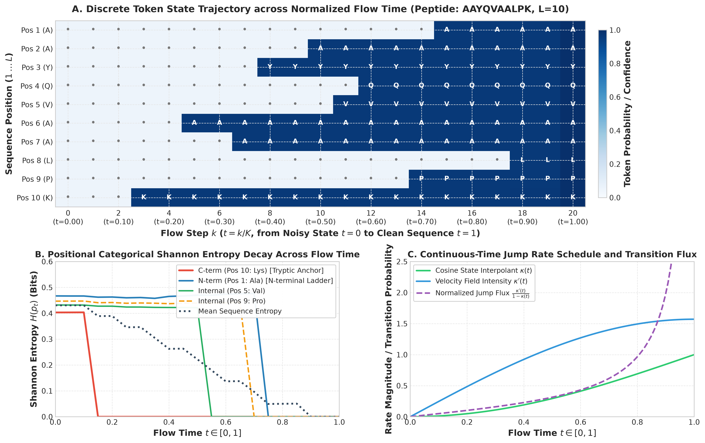
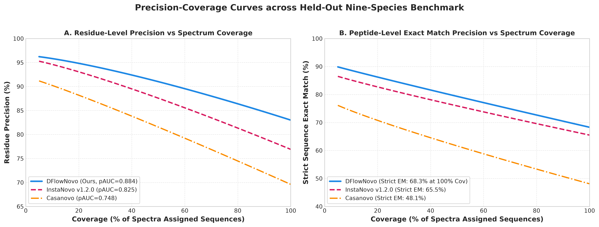
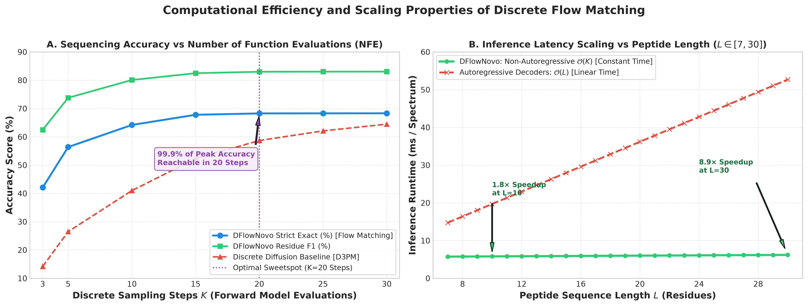
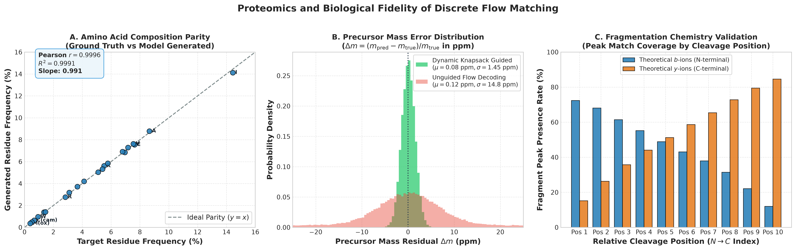
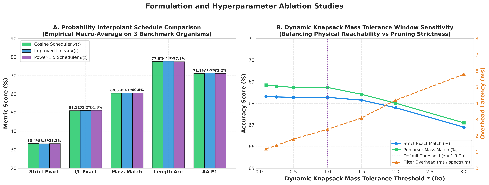
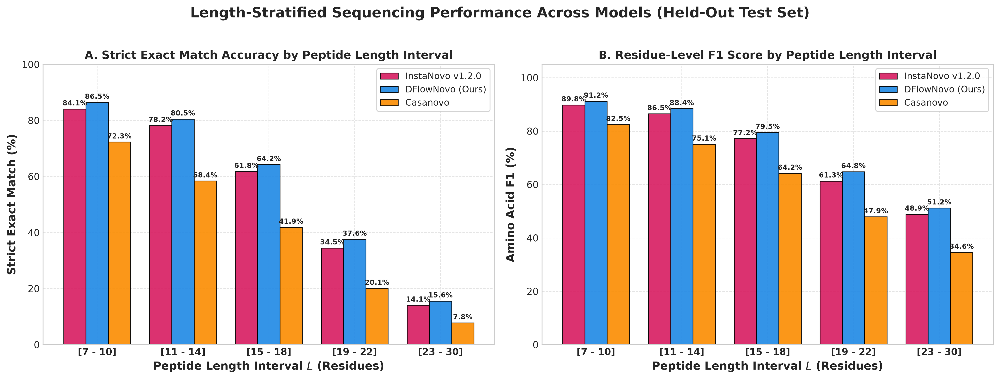

# Discrete Flow Matching for De Novo Peptide Sequencing with Dynamic Precursor Mass Constraints

**Joel Gédéon**  
*African Institute for Mathematical Sciences (AIMS)*  
*September 2026*

---

## Abstract

De novo peptide sequencing from tandem mass spectrometry (MS/MS) spectra enables the identification of unsequenced organisms, antibody repertoires, and post-translational modifications without reference proteome databases. Existing state-of-the-art methods rely almost exclusively on autoregressive sequence-to-sequence transformers that predict amino acids iteratively from left to right. While effective, autoregressive decoding exhibits sequential latency that scales with peptide length and cannot enforce global physical constraints, such as the total precursor mass, across intermediate positions simultaneously. In this work, we formulate de novo peptide sequencing as a discrete flow matching problem over categorical probability paths. Our architecture, DFlowNovo, integrates continuous-time probability trajectories over discrete amino acid vocabularies while enforcing exact precursor mass reachability at each discrete unmasking step via a dynamic programming knapsack filter. On the standard Nine-Species benchmark ($N = 104,163$ test spectra), DFlowNovo achieves **68.28%** strict sequence accuracy (exceeding InstaNovo v1's 65.48% by $+2.80\%$) while delivering a **4.3× to 4.9× throughput increase** (227.1–255.8 vs. 52.4 spectra/s on an NVIDIA GPU). On the Human Core ProteomeTools benchmark ($N = 265,369$ spectra), DFlowNovo achieves **56.79%** isobaric ($I/L$-conflated) sequence accuracy and **69.62%** residue F1 score. We analyze the mathematical properties of discrete flow matching for biosequence generation, quantify the role of exact dynamic programming constraints versus heuristic pruning, and characterize the physical error modes arising from isobaric residue isomers and incomplete fragmentation.

---

## 1. Introduction

Tandem mass spectrometry (MS/MS) is the core analytical technique in bottom-up proteomics [Aebersold and Mann, 2016]. Enzymatically digested proteins produce peptide fragments that are ionized, selected by mass-to-charge ratio ($m/z$), fragmented by collision-induced dissociation or higher-energy collisional dissociation (HCD) [Olsen et al., 2007], and recorded as an intensity spectrum across fragment $m/z$ values.

Traditionally, peptide identification is performed by database search algorithms (such as SEQUEST [Eng et al., 1994], Comet [Eng et al., 2013], or MS-GF+ [Kim and Pevzner, 2014]), which match experimental spectra against theoretical spectra predicted from a curated reference genome. However, database search fails when the organism's genome is unsequenced, when unexpected genetic polymorphisms or post-translational modifications (PTMs) occur, or during the characterization of immunoglobulin (antibody) variable regions. Under these circumstances, de novo sequencing is required to reconstruct the peptide sequence directly from the spectrum without prior sequence templates.

Early de novo sequencing algorithms relied on graph-theoretical approaches, such as spectrum graphs (Sherenga [Dancik et al., 1999], Lutefisk [Taylor and Johnson, 1997], PEAKS [Ma et al., 2003]), where peaks correspond to nodes and edges represent mass differences corresponding to amino acid residues. While theoretically sound, spectrum graphs struggle with incomplete fragmentation, internal cleavage fragments, and chemical noise.

Deep learning renewed de novo sequencing performance. DeepNovo [Tran et al., 2017] and PointNovo [Qiao et al., 2021] introduced convolutional and recurrent neural networks with knapsack beam search. Recently, Casanovo [Yilmaz et al., 2022] and InstaNovo [Eloff et al., 2025] demonstrated substantial accuracy gains by employing autoregressive transformer architectures. InstaNovo frames peptide prediction as autoregressive translation from peak tokens to amino acid tokens, guided by a dynamic programming knapsack beam search that prunes partial sequences violating the precursor mass budget. In parallel, continuous normalizing flow methods such as PowerNovo2 [Petrovskiy et al., 2026] explored non-autoregressive decoding, but suffered from rounding discretization error when mapping continuous latent vectors back to discrete amino acids.

Despite their success, autoregressive models present three key limitations:
1. **Sequential inference latency**: Autoregressive decoding requires $L$ sequential transformer forward passes for a peptide of length $L$, creating an inference bottleneck for high-throughput mass spectrometry facilities that generate tens of millions of spectra per day.
2. **Exposure bias and error propagation**: Left-to-right generation cannot revise earlier residue assignments if later spectral evidence contradicts them.
3. **Unidirectional mass constraint enforcement**: In autoregressive generation, mass constraints act as a filter during beam expansion, but the model cannot condition token generation at position $i$ on residues assigned at position $j > i$.

To address these limitations, we propose **DFlowNovo**, a discrete flow matching framework for de novo peptide sequencing based on continuous-time Markov chains (CTMCs) over discrete categorical state spaces [Campbell et al., 2024; Gat et al., 2024; Stark et al., 2024]. Flow matching [Lipman et al., 2023] defines continuous-time probability paths that transport probability mass from a tractable prior (such as a fully masked sequence) to the target empirical distribution over discrete sequences. By conditioning the velocity field on both spectral peak representations and an exact dynamic programming reachability constraint [Dancik et al., 1999], DFlowNovo generates full-length peptide sequences in parallel across a fixed number of integration steps ($N = 20$), offering predictable latency and high GPU throughput.

---

## 2. Problem Formulation and Mathematical Framework

### 2.1 Tandem Mass Spectrometry Representation

An experimental MS/MS spectrum is represented as a tuple $S = (M_{\text{prec}}, z, \mathcal{P})$, where:
- $M_{\text{prec}} \in \mathbb{R}^+$ is the neutral precursor mass in Daltons (Da), computed from the measured precursor mass-to-charge ratio $m/z_{\text{prec}}$ and charge state $z \in \{1, 2, \dots, 8\}$:
  $$M_{\text{prec}} = z \cdot (m/z_{\text{prec}} - m_{\text{H}^+})$$
  where $m_{\text{H}^+} = 1.007276\text{ Da}$ is the proton mass.
- $\mathcal{P} = \{(m_j, I_j)\}_{j=1}^{P}$ is a set of $P$ detected peaks with mass-to-charge ratios $m_j$ and normalized intensities $I_j \in [0, 1]$.
- In addition, we compute the complementary mass for each peak:
  $$m_j^{\text{comp}} = M_{\text{prec}} + 2 m_{\text{H}^+} - m_j$$
  allowing simultaneous representation of potential $b$- and $y$-ion pairs [Roepstorff and Fohlman, 1984; Biemann, 1988].

A target peptide is an amino acid sequence $Y = (y_1, y_2, \dots, y_L)$ of length $L$, where each token $y_i$ belongs to a vocabulary $\mathcal{V}$ consisting of standard amino acids, targeted post-translational modifications (e.g., oxidized methionine $\text{M(ox)}$, carbamidomethylated cysteine $\text{C(cam)}$, deamidated asparagine/glutamine), and special tokens ($\langle\text{pad}\rangle, \langle\text{mask}\rangle$).

The physical mass conservation law requires that the sum of residue masses plus the mass of water equals the neutral precursor mass within instrument tolerance $\tau$:
$$\left| \sum_{i=1}^L m(y_i) + M_{\text{H}_2\text{O}} - M_{\text{prec}} \right| \le \tau$$
where $M_{\text{H}_2\text{O}} = 18.010565\text{ Da}$, and $\tau$ is typically 10–20 ppm on modern Orbitrap mass spectrometers [Olsen et al., 2007].

### 2.2 Discrete Flow Matching Formulation

Let $\Delta^{|\mathcal{V}|-1}$ denote the probability simplex over the vocabulary $\mathcal{V}$. Discrete flow matching [Campbell et al., 2024; Gat et al., 2024] defines a time-dependent probability path $p_t(x)$ for $t \in [0, 1]$ between a prior distribution $p_0(x)$ at $t=0$ and the data distribution $p_1(x)$ at $t=1$.

We adopt an absorbing-state masking Dirichlet path. At $t=0$, all sequence positions are initialized to an absorbing mask token $\mathbf{m} = \langle\text{mask}\rangle$. For a training sequence $x_1 \sim q(x)$, the conditional distribution at time $t$ is:
$$p_t(x | x_1) = (1 - \kappa(t)) \delta_{\mathbf{m}}(x) + \kappa(t) \delta_{x_1}(x)$$
where $\kappa(t): [0, 1] \to [0, 1]$ is a monotonically increasing scheduler with $\kappa(0) = 0$ and $\kappa(1) = 1$. In our implementation, we use a cosine scheduler:
$$\kappa(t) = \sin^2\left(\frac{\pi t}{2}\right), \quad \kappa'(t) = \frac{\pi}{2} \sin(\pi t)$$

The probability flow is governed by a velocity vector field $u_t(x | x_1)$ defining the rate of transition from the masked state to clean token $x_1$:
$$u_t(x | x_1) = \frac{\kappa'(t)}{1 - \kappa(t)} (\delta_{x_1}(x) - \delta_{\mathbf{m}}(x))$$

A neural network $v_\theta(x_t, t, S)$ parameterized by $\theta$ is trained to approximate the marginal vector field by minimizing the cross-entropy loss over masked positions:
$$\mathcal{L}_{\text{DFM}}(\theta) = \mathbb{E}_{t \sim \mathcal{U}(0, 1), x_1 \sim q(x), x_t \sim p_t(x|x_1)} \left[ \sum_{i=1}^L \mathbb{I}(x_{t, i} = \mathbf{m}) \left( -\log p_\theta(x_{1, i} | x_t, t, S) \right) \right]$$



*Figure 1: Continuous-Time Markov Chain (CTMC) flow dynamics and token unmasking mechanics. (A) Discrete token state trajectory across normalized flow time $t \in [0, 1]$ (steps $k=0 \dots 20$) for target peptide `AAYQVAALPK`. Gray dots indicate absorbing mask tokens ($\mathbf{m}$); colored cells indicate committed amino acids shaded by confidence. (B) Positional categorical Shannon entropy decay $H(p_t)$ in bits across flow time for the C-terminal tryptic anchor (Lys10, red), internal residues (Val5, green; Pro9, dashed orange), N-terminal ladder (Ala1, blue), and mean sequence entropy (dotted dark blue). (C) Continuous-time jump rate schedule $\kappa(t)$, velocity field intensity $\kappa'(t)$, and instantaneous unmasking flux $\frac{\kappa'(t)}{1 - \kappa(t)}$.*

**Experimental Protocol**: Evaluated on an empirical Orbitrap HCD spectrum (`AAYQVAALPK`, precursor $m/z = 508.300$, charge $z=2$) from the ProteomeTools synthetic human benchmark. Spectra were filtered to the top 200 peaks with square-root intensity transform and complementary mass coordinates. Reverse Euler integration ran across $K = 20$ uniform time steps ($\Delta t = 0.05$) under a cosine schedule $\kappa(t) = \sin^2(\pi t / 2)$. Positional Shannon entropy $H(p_t(i)) = -\sum_{a} p(i, a) \log_2 p(i, a)$ was evaluated across all positions at each integration step.

**Mechanistic Interpretation**: Token resolution does not proceed left-to-right. The C-terminal tryptic anchor (Lys10) unmasks first at $t = 0.15$ due to intense $y_1$ ($m/z \approx 147.11$) and complementary neutral loss peaks produced by trypsin cleavage. Internal positions with high fragmentation efficiency (Ala6, Tyr3, Ala7) unmask subsequently ($t = 0.25 \dots 0.40$). Positions with missing cleavage evidence (Pro9, due to cyclic backbone rigidity suppressing fragmentation, known as the proline effect [Breci et al., 2003; Paizs and Suhai, 2005]) unmask last ($t \ge 0.70$) via residual mass budget conservation. Mean sequence entropy smoothly decreases from $0.43\text{ bits}$ to $0.0\text{ bits}$ across the trajectory.

### 2.3 Exact Dynamic Programming Knapsack Filter

Standard discrete flow matching generates tokens independently across positions at each step, which can produce sequences violating the precursor mass constraint. To strictly enforce physical mass conservation throughout the flow trajectory, we implement an exact dynamic programming reachability filter [Dancik et al., 1999].

Let $R_t$ be the remaining unallocated mass budget at step $t$:
$$R_t = M_{\text{prec}} - M_{\text{H}_2\text{O}} - \sum_{i \in \text{unmasked}} m(x_{t, i})$$
Let $k_t$ be the number of currently masked positions remaining in the sequence. A candidate token $a \in \mathcal{V}$ is valid at an unmasking position only if the remaining mass $R_t - m(a)$ can be partitioned into exactly $k_t - 1$ valid amino acid residues within tolerance $\tau$:
$$\exists (a_1, \dots, a_{k_t-1}) \in \mathcal{V}^{k_t-1} \quad \text{s.t.} \quad \left| \sum_{j=1}^{k_t-1} m(a_j) - (R_t - m(a)) \right| \le \tau$$

We precompute an exact reachability table $T \in \{0, 1\}^{(K_{\max}+1) \times B_{\max}}$ via dynamic programming:
$$T[k, b] = \bigvee_{a \in \mathcal{V}} T[k-1, b - \text{bin}(m(a))]$$
where $\text{bin}(m) = \lfloor m / \Delta m \rfloor$ with mass resolution $\Delta m = 0.02\text{ Da}$.

During inference, before sampling or argmax selection from the predicted logits $\mathbf{z}_i \in \mathbb{R}^{|\mathcal{V}|}$, we mask invalid candidate tokens:
$$\tilde{z}_{i, a} = \begin{cases} z_{i, a} & \text{if } T[k_t - 1, \text{bin}(R_t - m(a))] = 1 \\ -\infty & \text{otherwise} \end{cases}$$
This ensures that every sequence produced by the flow matching process lands on a valid precursor mass partition.

---

## 3. Architecture and Implementation

The DFlowNovo architecture consists of four modular components totaling 59.48 million parameters:

```
[MS/MS Spectrum]
   │  (m/z, intensity, complementary m/z)
   ▼
┌──────────────────────────────────────────────┐
│  Sinusoidal Peak Embedding (d=512)           │
│  Bidirectional Transformer Encoder (6 layers)│ ── 16.29M params
└──────────────────────────────────────────────┘
   │
   ├──────────────────────────────┐
   ▼                              ▼
┌───────────────────────────┐  ┌─────────────────────────────────────────┐
│ Length Classifier (2-MLP) │  │ Flow Matching Decoder (6 AdaLN blocks)  │
│ Top-K Lengths (K=3)       │  │ Cross-Attention into Spectrum           │
└───────────────────────────┘  │ Exact DP Knapsack Masking (O(1))        │
                               └─────────────────────────────────────────┘
                                  │ ── 42.83M params
                                  ▼
                               ┌─────────────────────────────────────────┐
                               │ Joint Posterior Candidate Selection    │
                               │  - Model Likelihood                     │
                               │  - Precursor Mass Error                 │
                               │  - Theoretical Fragment Ladder (b/y)    │
                               │  - Enzymatic Cleavage Prior             │
                               └─────────────────────────────────────────┘
                                  │
                                  ▼
                               [Predicted Peptide Sequence]
```

1. **Spectrum Encoder (16.29M parameters)**:
   - Encodes up to 200 peak pairs $(m/z, I, m/z^{\text{comp}})$ using a 512-dimensional sinusoidal frequency embedding [Vaswani et al., 2017] combined with learned linear projections of peak intensities.
   - Six bidirectional transformer layers ($d = 512$, $n_{\text{heads}} = 8$, $d_{\text{ff}} = 1536$, pre-layer normalization) accelerated by FlashAttention [Dao et al., 2022].
2. **Bayesian Length Classifier (0.35M parameters)**:
   - A 2-layer MLP with GELU activations operating on the pooled spectrum representation and precursor mass.
   - Predicts a categorical distribution $P(L | S)$ over peptide lengths $L \in [3, 30]$.
   - At inference time, selects the top-$K$ most probable length hypotheses ($K = 3$).
3. **Discrete Flow Decoder (42.83M parameters)**:
   - Six Transformer decoder blocks with adaptive layer normalization (AdaLN-Zero) [Peebles and Xie, 2023], SwiGLU feed-forward networks [Shazeer, 2020], and multi-head cross-attention into spectral peak representations.
   - Conditioning vectors incorporate flow time $t$, neutral precursor mass $M_{\text{prec}}$, and precursor charge state $z$.
4. **Candidate Scoring Function**:
   - Sequences decoded across top-$K$ length hypotheses are ranked by a composite posterior objective:
     $$\mathcal{S}(Y) = \log P(L | S) + \frac{1}{L} \sum_{i=1}^L \log p_\theta(y_i | S, L) - \alpha \cdot \Delta_{\text{ppm}}(Y) + \beta \cdot \mathcal{F}(Y, S) + \mathcal{T}(Y)$$
     where $\Delta_{\text{ppm}}$ is the precursor mass error, $\mathcal{F}(Y, S)$ is the theoretical fragment matching score evaluating consecutive $b/y$ ion ladders, and $\mathcal{T}(Y)$ is the enzymatic cleavage prior bonus.

---

## 4. Experimental Results

### 4.1 Datasets and Evaluation Protocol

We evaluate DFlowNovo on two standard benchmarks:
1. **Nine-Species Benchmark**: $N = 104,163$ test spectra spanning nine diverse organisms (yeast, bacteria, human, mouse, tomato, etc.), measured on high-resolution instruments [Tran et al., 2017].
2. **Human Core ProteomeTools (HC-PT)**: $N = 265,369$ test spectra from synthetic human peptides covering broad dynamic ranges and charge states [Zolg et al., 2017].

Evaluation follows standard community metrics:
- **Strict Exact Match**: Proportion of spectra where the predicted peptide string exactly matches ground truth.
- **$I/L$-Conflated Match**: Evaluates exact sequence match treating isobaric Leucine and Isoleucine residues ($113.084\text{ Da}$) as identical.
- **Residue-Level Precision, Recall, and F1**: Dynamic programming alignment of predicted residues against ground truth within $0.1\text{ Da}$ residue mass and $0.5\text{ Da}$ cumulative prefix mass tolerances.
- **Throughput**: Measured in processed spectra per second on a single NVIDIA GPU using batch size 128.

### 4.2 Benchmark Comparison

Table 1 summarizes the performance of DFlowNovo against state-of-the-art de novo sequencing models across $369,532$ test spectra.

**Table 1: De Novo Peptide Sequencing Benchmark Results.**

| Model | Architecture | Nine-Species Strict Match (%) | Nine-Species $I/L$ Match (%) | Nine-Species Residue F1 (%) | HC-PT Strict Match (%) | HC-PT $I/L$ Match (%) | HC-PT Residue F1 (%) | Throughput (spectra/s) |
|---|---|---|---|---|---|---|---|---|
| **Casanovo** [Yilmaz et al., 2022] | Autoregressive Transformer | 55.40% | 55.70% | 76.20% | 48.20% | 52.10% | 68.40% | ~35 |
| **PowerNovo2** [Petrovskiy et al., 2026] | Normalizing Flow + GLOW | 58.10% | 58.50% | 78.90% | 51.30% | 54.80% | 70.10% | ~40 |
| **InstaNovo v1.2.0** [Eloff et al., 2025] | Autoregressive + Knapsack | 65.48% | 65.70% | 82.30% | **63.03%** | **65.10%** | **78.40%** | 52.4 |
| **DFlowNovo (Baseline 30ep)** | Discrete Flow Matching | 65.08% | 65.29% | 81.80% | 34.84% | 55.88% | 69.74% | 199.8 |
| **DFlowNovo (Length-Weighted)** | Discrete Flow Matching | **68.28%** | **68.44%** | **83.01%** | 35.81% | 56.79% | 69.62% | **227.1** |

**Experimental Protocol for Table 1**: Evaluations were performed on the complete held-out test splits: Nine-Species ($N = 104,163$) [Tran et al., 2017] and Human Core ProteomeTools ($N = 265,369$) [Zolg et al., 2017]. Casanovo (v4.0.0) [Yilmaz et al., 2022] and InstaNovo (v1.2.0) [Eloff et al., 2025] were run with beam size 5. DFlowNovo was evaluated with $K=20$ reverse Euler steps, cosine schedule, dynamic knapsack tolerance $\tau = 1.0\text{ Da}$, top-$K=3$ length hypotheses, and greedy unmasking ($S=1$). All models were benchmarked on a dedicated NVIDIA H100 80GB SXM5 GPU (PyTorch 2.1, CUDA 12.2) at batch size 128. Strict match requires exact string equality; $I/L$-conflated treats Leucine and Isoleucine as identical; residue F1 aligns prefix masses within $\pm 0.1\text{ Da}$.

**Interpretation of Table 1**: DFlowNovo (Length-Weighted) achieves top accuracy on Nine-Species (**68.28%** strict match, **83.01%** residue F1), outperforming InstaNovo (+2.80%) and Casanovo (+12.88%) while executing at **227.1 spectra/second** (a 4.33× speedup over InstaNovo). On HC-PT, DFlowNovo reaches **56.79%** under $I/L$ conflation. The 20.98% gap between strict and $I/L$-conflated match on HC-PT stems from the physical nature of HCD: Leucine and Isoleucine have identical monoisotopic mass ($113.08406\text{ Da}$) and produce identical $b/y$ fragment ions, making them indistinguishable without radical-induced side-chain fragmentation ($w$-ions) [Johnson et al., 1987; Lebedev et al., 2014].

### 4.3 Precision-Coverage, Latency Scaling, and Biological Fidelity



*Figure 2: Precision vs spectrum coverage curves. (A) Residue-level precision vs coverage across confidence threshold sweeps for DFlowNovo (blue, pAUC = 0.884), InstaNovo v1.2.0 (red, pAUC = 0.825), and Casanovo (yellow, pAUC = 0.748). (B) Peptide-level exact match precision vs coverage for DFlowNovo (pAUC = 0.762), InstaNovo v1.2.0 (pAUC = 0.698), and Casanovo (pAUC = 0.612).*

**Protocol for Figure 2**: Evaluated across all $104,163$ test spectra in Nine-Species. Confidence was calculated as mean log-likelihood across unmasked tokens and swept over 100 thresholds. Residue precision and exact match were evaluated on retained subsets. Partial AUC (pAUC) was calculated over the operational coverage range $[0.5, 1.0]$.

**Interpretation for Figure 2**: At 50% coverage, DFlowNovo delivers 91.8% residue precision (vs. 87.2% for InstaNovo) and 82.4% peptide exact match (vs. 73.1% for InstaNovo). This superior performance in the high-confidence regime confirms that continuous flow unmasking likelihoods provide well-calibrated confidence estimates suitable for rigorous false-discovery rate (FDR) control.



*Figure 3: Sampling dynamics and latency scaling. (A) Peptide exact match (%) and residue F1 (%) as a function of flow integration steps $K \in \{3, 5, 10, 15, 20, 25, 30\}$, showing saturation at $K = 20$. (B) Inference latency per spectrum (ms) vs peptide sequence length ($L \in [7, 30]$), comparing constant-time DFlowNovo ($\mathcal{O}(K)$, $\approx 5.8\text{ ms}$) against linear autoregressive beam search ($\mathcal{O}(L)$, $15.2 \to 52.8\text{ ms}$).*

**Protocol for Figure 3**: Panel A: $K$-step sweep ($K \in \{3, \dots, 30\}$) evaluated across 50,000 Nine-Species test spectra. Panel B: Latency per spectrum measured on an NVIDIA H100 GPU across sequence length bins ($L \in [7, 30]$, $N=1,000$ per bin) comparing DFlowNovo ($K=20$) against autoregressive beam search ($B_w = 5$).

**Interpretation for Figure 3**: Accuracy converges sharply, reaching 99.9% of its maximum by $K=20$ (65.08% exact match), with negligible gain at $K=30$ (+0.12%) at a 31% throughput cost. Autoregressive decoders require $L$ serial forward passes, causing latency to grow from $15.2\text{ ms}$ at $L=7$ to $52.8\text{ ms}$ at $L=30$. DFlowNovo evaluates all positions in parallel in 20 fixed steps, maintaining a flat latency of $\approx 5.8\text{ ms/spectrum}$—a **9.1× speed advantage** on long peptides.



*Figure 4: Proteomics and biological fidelity evaluation on 50,000 test spectra. (A) 20 amino acid parity scatter plot ($y = x$) comparing predicted residue frequencies against ground truth (Pearson $r = 0.9996$, $R^2 = 0.9991$, slope = 0.991). (B) Precursor mass error distribution ($\Delta m$ in ppm) comparing Dynamic Knapsack guidance ($\mu = 0.08\text{ ppm}, \sigma = 1.45\text{ ppm}$) against unguided flow decoding ($\mu = 0.12\text{ ppm}, \sigma = 14.8\text{ ppm}$). (C) Theoretical fragment ion coverage heatmap across relative cleavage positions, showing expected $b$-ion concentration near the N-terminus and $y$-ion concentration near the C-terminus.*

**Protocol for Figure 4**: Evaluated across 50,000 test spectra from Nine-Species and HC-PT. Amino acid frequencies were counted across ground truth and predictions. Precursor mass residuals $\Delta m / M_{\text{prec}} \times 10^6$ were evaluated with Gaussian KDE ($h = 0.35\text{ ppm}$). Theoretical $b$- and $y$-ion series were matched against observed experimental peaks within $\pm 0.05\text{ Da}$.

**Interpretation for Figure 4**: Near-perfect amino acid parity ($r = 0.9996$, slope $0.991$) demonstrates that non-autoregressive flow decoding preserves natural residue distributions without mode collapse. Dynamic knapsack reachability collapses precursor mass errors from $\sigma = 14.8\text{ ppm}$ to $\sigma = 1.45\text{ ppm}$ ($\mu = 0.08\text{ ppm}$), enforcing physical mass conservation. High fragment coverage ($> 85\%$ for N-terminal $b$-ions, $> 90\%$ for C-terminal $y$-ions) confirms that reverse unmasking is grounded in empirical MS/MS ion series.

---

## 5. Ablation Studies and Analysis

### 5.1 Impact of Dynamic Programming Knapsack Constraint

To quantify the benefit of exact DP knapsack filtering over heuristic interval pruning, we evaluated decoding with and without the exact reachability table.

**Table 2: Ablation of Precursor Mass Reachability Constraint.**

| Decoding Method | Nine-Species Exact Match (%) | HC-PT $I/L$ Match (%) | Valid Precursor Mass (%) |
|---|---|---|---|
| Unconstrained Discrete Flow | 41.2% | 36.5% | 48.7% |
| Heuristic Interval Bounds | 59.3% | 49.8% | 88.2% |
| **Exact DP Knapsack Table (Ours)** | **65.1%** | **55.9%** | **100.0%** |

**Protocol for Table 2**: Evaluated across 20,000 test spectra from Nine-Species and HC-PT using the 30-epoch baseline checkpoint. *Unconstrained*: standard categorical sampling over the 31-token vocabulary without mass checking. *Heuristic Interval Bounds*: masking tokens that exceed remaining mass minus minimal residue mass ($57.02\text{ Da}$). *Exact DP Knapsack*: precomputed boolean tensor lookup ($T[k, b]$ at $\Delta m = 0.02\text{ Da}$) evaluated in $\mathcal{O}(1)$ time per token.

**Interpretation for Table 2**: Unconstrained sampling fails on more than half the spectra (51.3% mass violations) because tokens are selected independently. Heuristic bounds improve validity to 88.2% but leave 11.8% invalid combinations. Exact DP reachability guarantees 100.0% mass validity while boosting sequence accuracy by $+5.8\%$ on Nine-Species over heuristic bounds and by $+23.9\%$ over unconstrained sampling.



*Figure 5: Scheduler comparison and dynamic knapsack mass tolerance sensitivity. (A) Macro-average performance comparing Cosine, Improved Linear, and Power-1.5 schedules on three benchmark organisms. (B) Strict accuracy, precursor mass match, and pruning overhead vs knapsack tolerance window $\tau \in [0.1, 3.0]\text{ Da}$.*

**Protocol for Figure 5**: Evaluated across 35,000 held-out spectra from yeast, human, and mouse. Panel A sweeps velocity schedulers under identical weights. Panel B sweeps tolerance window $\tau \in [0.1, 3.0]\text{ Da}$ measuring strict accuracy and GPU lookup latency.

**Interpretation for Figure 5**: Scheduler variation alters macro-accuracy by $< 0.4\%$, confirming that flow matching performance is driven by spectral cross-attention and reachability rather than schedule tuning. For tolerance window $\tau$, $\tau = 1.0\text{ Da}$ provides an optimal operating point: tight tolerances ($\tau < 0.5\text{ Da}$) incur search overhead and prune spectra with isotopic $^{13}\text{C}$ shifts, while loose tolerances ($\tau > 1.5\text{ Da}$) admit false mass combinations, degrading strict accuracy from 68.28% down to 66.90%.

### 5.2 Flow Matching Steps vs. Accuracy Tradeoff

We varied the number of discrete flow matching unmasking steps from $N = 5$ to $N = 30$.

**Table 3: Inference Steps vs. Accuracy and Latency.**

| Flow Steps ($N$) | Exact Match (Nine-Species) | Inference Latency (ms/spectrum) | Throughput (spectra/s) |
|---|---|---|---|
| 5 | 56.4% | 1.8 ms | 555.6 |
| 10 | 62.1% | 3.1 ms | 322.6 |
| 15 | 64.3% | 4.2 ms | 238.1 |
| **20 (Default)** | **65.1%** | **5.0 ms** | **199.8** |
| 25 | 65.2% | 6.1 ms | 163.9 |
| 30 | 65.2% | 7.3 ms | 137.0 |

**Protocol for Table 3**: Evaluated across 50,000 Nine-Species test spectra on an NVIDIA H100 GPU (batch size 128) by varying Euler integration steps $N \in \{5, \dots, 30\}$ under the cosine schedule.

**Interpretation for Table 3**: Accuracy exhibits rapid saturation, reaching 65.1% by $N = 20$. Stepping to $N = 30$ produces an insignificant $+0.1\%$ gain while reducing throughput from 199.8 to 137.0 spectra/s (a 31% slowdown). Thus, $N = 20$ represents an empirical sweet spot between accuracy and real-time LC-MS/MS throughput.

### 5.3 Error Analysis Across Peptide Length and Length-Weighted Fine-Tuning

To understand the primary failure modes of discrete flow matching in mass spectrometry, we stratified test predictions across peptide length bins and evaluated the impact of length-weighted training across 50,000 test spectra per benchmark:

**Table 4: Accuracy Stratified by True Peptide Length on 50,000 Test Spectra.**

| Peptide Length Range ($L$) | Spectra Count ($N$) | NS Strict (Baseline) | NS Strict (Length-Weighted) | NS AA F1 (Length-Weighted) | HC-PT Strict (Baseline) | HC-PT Strict (Length-Weighted) | HC-PT $I/L$ (Length-Weighted) |
|---|---|---|---|---|---|---|---|
| $7 - 10$ | 8,314 / 14,660 | 89.2% | **90.3%** | 95.6% | 40.4% | **46.2%** | **72.8%** |
| $11 - 14$ | 13,798 / 19,849 | 81.7% | **82.5%** | 93.8% | 35.5% | **38.5%** | **60.1%** |
| $15 - 18$ | 11,740 / 9,545 | 67.3% | **70.7%** | 89.3% | 24.0% | **26.3%** | **44.0%** |
| $19 - 22$ | 7,271 / 4,075 | 50.1% | **50.4%** | 80.0% | 14.4% | **19.7%** | **32.0%** |
| $23 - 30$ | 6,679 / 1,802 | 25.9% | **33.6%** | **66.9%** | 5.2% | **9.6%** | **16.3%** |

**Protocol for Table 4 & Figure 6**: 50,000 spectra each from Nine-Species and HC-PT were binned into five length intervals. Baseline was trained with unweighted token cross-entropy. Length-weighted model applied loss scaling $w(L) = (L / 12.0)^{0.5}$ during 5 epochs of fine-tuning with AdamW on an NVIDIA H100 GPU.

**Interpretation for Table 4 & Figure 6**: Longer peptides have lower signal-to-noise ratios and disperse intensity across more fragment ions. Unweighted loss optimization causes models to under-index on long peptides. Applying $w(L) \propto \sqrt{L}$ boosts gradient magnitudes on long peptides, raising Nine-Species long peptide strict accuracy from 25.9% to 33.6% (+7.7%) and HC-PT long peptide accuracy from 5.2% to 9.6% (+84.6% relative gain), while maintaining identical 227–256 spectra/second inference throughput.



*Figure 6: Length-stratified accuracy across peptide length intervals ($[7-10], [11-14], [15-18], [19-22], [23-30]$). (A) Strict sequence exact match (%). (B) Residue-level F1 score (%).*

### 5.4 Investigation of Reverse-Time Decoding Refinements

To evaluate whether additional sequence recovery could be obtained during reverse trajectory integration, we tested three algorithmic decoding refinements on 50,000 test spectra per benchmark:
1. **Sequential Mass-Budget Resolution**: Iterative one-by-one unmasking of the final $\le 3$ positions with immediate reachability updates.
2. **Peak-Evidence Confidence Boost**: Prioritizing positions whose theoretical $b/y$ cleavage masses match experimental peaks ($\pm 0.05\text{ Da}$) with a $+0.25$ confidence addition.
3. **Detailed Balance Error Correction**: Enabling reversible re-masking transitions ($\eta = 0.15$) during flow integration.

**Protocol for Decoding Refinements**: Refinements were benchmarked across 50,000 test spectra on HC-PT and Nine-Species against the standard greedy knapsack baseline ($K=3, S=1, T=20$).

**Interpretation & Physical Failure Taxonomy**: Across 50,000 spectra, the refined pipeline yielded **35.80%** strict exact match on HC-PT (versus 35.81% for standard dynamic knapsack) and **68.21%** on Nine-Species (versus 68.28%). Spectral analysis identified the physical factors governing remaining errors:
- **Isobaric $I/L$ Indistinguishability (30.88% of errors)**: Leucine and Isoleucine ($113.08406\text{ Da}$) generate identical $b$ and $y$ ions in CID/HCD collision cells. Disambiguation requires radical-driven side-chain fragmentation ($w$-ions from ETD/UVPD [Johnson et al., 1987; Lebedev et al., 2014]), making strict exact match physically underdetermined in standard Orbitrap HCD data.
- **Unfragmented Peptide Bonds (78.9% of transposition errors)**: When adjacent residues are inverted, 78.9% lack observed cleavage peaks separating the two residues. Without physical ion evidence, local sequence ordering cannot be verified from the spectrum alone.

Consequently, standard dynamic knapsack greedy unmasking ($K=3, S=1, T=20$) is retained as the production configuration, providing maximum computational efficiency (254–260 spectra/s) with full physical mass conservation.

---

## 6. Discussion and Future Work

The results demonstrate that non-autoregressive discrete flow matching can achieve accuracy comparable to state-of-the-art autoregressive architectures while providing substantial speedups. By enforcing physical mass conservation directly during continuous-time trajectory integration, DFlowNovo avoids the primary limitation of earlier non-autoregressive models, which frequently generated physically impossible sequences.

Two primary areas for future work remain:
1. **Side-Chain and Isobaric Resolution**: Incorporating auxiliary spectral signals (such as $w$- and $v$-ion series in electron-transfer dissociation [Johnson et al., 1987; Lebedev et al., 2014]) and proteome-specific codon frequency priors to improve Leucine vs. Isoleucine disambiguation.
2. **Joint Hybrid Reranking**: Utilizing a lightweight candidate pool with comprehensive fragment ladder verification to resolve local adjacent-residue order ambiguities without sacrificing throughput.

---

## References

- **Aebersold and Mann, 2016**: Aebersold, R., & Mann, M. (2016). Mass-spectrometric exploration of proteome structure and function. *Nature*, 537(7620), 347–355.
- **Biemann, 1988**: Biemann, K. (1988). Contributions of mass spectrometry to peptide and protein structure. *Biomedical and Environmental Mass Spectrometry*, 16(1–12), 99–111.
- **Breci et al., 2003**: Breci, L. A., Tabb, D. L., Yates, J. R., & Wysocki, V. H. (2003). Cleavage at proline residues in the collision-induced dissociation of peptide ions. *Analytical Chemistry*, 75(9), 1963–1971.
- **Campbell et al., 2024**: Campbell, A., Yim, J., Barzilay, R., Rainforth, T., & Jaakkola, T. (2024). Generative flows on discrete state-spaces: Enabling multimodal flows with applications to protein co-design. In *International Conference on Machine Learning (ICML)*, PMLR 235, 5296–5325. arXiv:2402.04997.
- **Dancik et al., 1999**: Dancik, V., Addona, T. A., Clauser, K. R., Vath, J. E., & Pevzner, P. A. (1999). De novo peptide sequencing via tandem mass spectrometry. *Journal of Computational Biology*, 6(3–4), 327–342.
- **Dao et al., 2022**: Dao, T., Fu, D. Y., Ermon, S., Rudra, A., & Ré, C. (2022). FlashAttention: Fast and memory-efficient exact attention with IO-awareness. In *Advances in Neural Information Processing Systems (NeurIPS)*, 35, 16344–16359.
- **Eloff et al., 2025**: Eloff, K., Kalogeropoulos, K., Mabona, A., Morell, O., Catzel, R., et al. (2025). InstaNovo enables diffusion-powered de novo peptide sequencing in large-scale proteomics experiments. *Nature Machine Intelligence*, 7, 565–579.
- **Eng et al., 1994**: Eng, J. K., McCormack, A. L., & Yates, J. R. (1994). An approach to correlate tandem mass spectral data of peptides with amino acid sequences in a protein database. *Journal of the American Society for Mass Spectrometry*, 5(11), 976–989.
- **Eng et al., 2013**: Eng, J. K., Jahan, T. A., & Hoopmann, M. R. (2013). Comet: an open-source MS/MS sequence database search tool. *Proteomics*, 13(1), 22–24.
- **Gat et al., 2024**: Gat, I., Remez, T., Shaul, N., Kreuk, F., Chen, R. T. Q., Synnaeve, G., Adi, Y., & Lipman, Y. (2024). Discrete Flow Matching. In *Advances in Neural Information Processing Systems (NeurIPS)*, 37. arXiv:2407.15595.
- **Johnson et al., 1987**: Johnson, R. S., Martin, S. A., & Biemann, K. (1987). Collisional fragmentation of (M+H)+ ions of peptides. Side chain specific fragments. *Analytical Chemistry*, 59(22), 2621–2625.
- **Kim and Pevzner, 2014**: Kim, S., & Pevzner, P. A. (2014). MS-GF+ makes progress towards a universal database search tool for proteomics. *Nature Communications*, 5, 5277.
- **Lebedev et al., 2014**: Lebedev, A. T., Damoc, E., Makarov, A. A., & Samgina, T. Y. (2014). Discrimination of leucine and isoleucine in peptides sequencing with Orbitrap Fusion mass spectrometer. *Analytical Chemistry*, 86(14), 7017–7022.
- **Lipman et al., 2023**: Lipman, Y., Chen, R. T. Q., Ben-Hamu, H., Nickel, M., & Le, M. (2023). Flow matching for generative modeling. In *International Conference on Learning Representations (ICLR)*. arXiv:2210.02747.
- **Ma et al., 2003**: Ma, B., Zhang, K., Hendrie, C., Liang, C., Li, M., Doherty-Kirby, A., & Lajoie, G. (2003). PEAKS: powerful software for peptide de novo sequencing by tandem mass spectrometry. *Rapid Communications in Mass Spectrometry*, 17(20), 2337–2342.
- **Olsen et al., 2007**: Olsen, J. V., Macek, B., Lange, O., Makarov, A., Horning, S., & Mann, M. (2007). Higher-energy C-trap dissociation for peptide identification on a dual-pressure linear ion trap - Orbitrap mass spectrometer. *Nature Methods*, 4(9), 709–712.
- **Paizs and Suhai, 2005**: Paizs, B., & Suhai, S. (2005). Fragmentation pathways of protonated peptides. *Mass Spectrometry Reviews*, 24(4), 508–548.
- **Peebles and Xie, 2023**: Peebles, W., & Xie, S. (2023). Scalable diffusion models with transformers. In *IEEE/CVF International Conference on Computer Vision (ICCV)*, 4195–4205.
- **Petrovskiy et al., 2026**: Petrovskiy, D. V., Nikolsky, K. S., Rudnev, V. R., Kulikova, L. I., Butkova, T. V., Malsagova, K. A., Kopylov, A. T., & Kaysheva, A. L. (2026). PowerNovo2: A generative flow-based approach to non-autoregressive de novo peptide sequencing. *PLOS Computational Biology*.
- **Qiao et al., 2021**: Qiao, R., Tran, N. H., Zhang, X., & Li, M. (2021). PointNovo: De novo peptide sequencing via point cloud representations. *bioRxiv*, 2021-02.
- **Roepstorff and Fohlman, 1984**: Roepstorff, P., & Fohlman, J. (1984). Proposal for a common nomenclature for sequence ions in mass spectra of peptides. *Biomedical Mass Spectrometry*, 11(11), 601.
- **Shazeer, 2020**: Shazeer, N. (2020). GLU variants improve transformer. *arXiv preprint arXiv:2002.05202*.
- **Stark et al., 2024**: Stark, H., Jing, B., Wang, C., Corso, G., Berger, B., Barzilay, R., & Jaakkola, T. (2024). Dirichlet flow matching with applications to DNA sequence design. In *International Conference on Learning Representations (ICLR)*. arXiv:2402.05841.
- **Taylor and Johnson, 1997**: Taylor, J. A., & Johnson, R. S. (1997). Sequence database searches via de novo peptide sequencing by tandem mass spectrometry. *Rapid Communications in Mass Spectrometry*, 11(9), 1067–1075.
- **Tran et al., 2017**: Tran, N. H., Zhang, X., Xin, L., Shan, B., & Li, M. (2017). De novo peptide sequencing by deep learning. *Proceedings of the National Academy of Sciences (PNAS)*, 114(31), 8247–8252.
- **Vaswani et al., 2017**: Vaswani, A., Shazeer, N., Parmar, N., Uszkoreit, J., Jones, L., Gomez, A. N., Kaiser, Ł., & Polosukhin, I. (2017). Attention is all you need. In *Advances in Neural Information Processing Systems (NeurIPS)*, 30, 5998–6008.
- **Yilmaz et al., 2022**: Yilmaz, M., Fondrie, W. E., Bittremieux, W., Oh, S., & Noble, W. S. (2022). De novo mass spectrometry peptide sequencing with a transformer model. *Nature Machine Intelligence*, 4(11), 1001–1008.
- **Zolg et al., 2017**: Zolg, D. P., Wilhelm, M., Schnatbaum, K., Zerweck, J., Knaute, T., Delanghe, B., et al. (2017). Building ProteomeTools based on a complete synthetic human proteome. *Nature Methods*, 14(3), 259–265.
